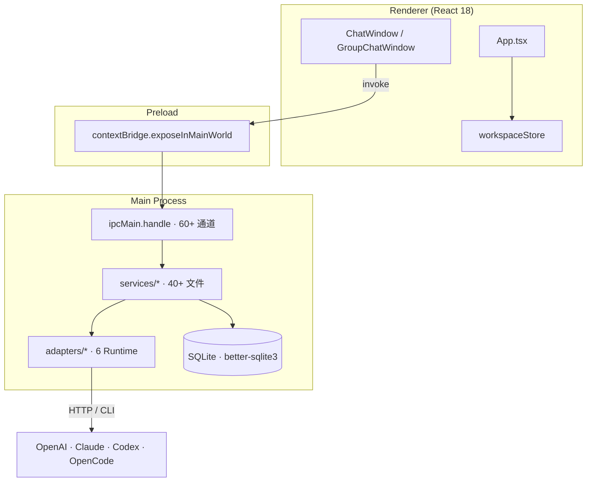

# AgentHub Desktop

> 本地优先的多 Agent 协作桌面应用 · **Single-Chat** × **Group-Chat** × **Orchestrator** × **Workspace**

AgentHub 是一款基于 Electron 的本地多 Agent 协作平台。它允许用户选定一个本地代码目录作为 **Workspace**，在 Workspace 内创建 **主 Agent**（Orchestrator）和多个 **子 Agent**（Specialist），支持：

- 🗨️ **单聊**：与单个 Agent 对话，支持流式输出、Diff 审查、产物预览。
- 👥 **群聊**：主 Agent 自动拆解任务、选择子 Agent、监督执行、汇总结果。
- 🤖 **多 Runtime 接入**：内置 OpenAI / Anthropic 兼容 LLM、Claude Code CLI、Codex CLI、OpenCode CLI、Mock Demo。
- 📂 **产物与 Diff 审查**：Agent 生成的网页、文档、PPT、Markdown、代码修改必须经用户确认才能落盘。
- 🧠 **上下文管理**：长会话自动压缩摘要，按 token 预算分配上下文。
- 🛡️ **本地安全**：所有文件操作经过 Workspace Root Guard 校验；Renderer 不直接访问文件系统。

> 📖 详细技术文档请见 [docs/技术文档.md](docs/技术文档.md)。

---

## 目录

- [项目截图](#项目截图)
- [核心特性](#核心特性)
- [技术栈](#技术栈)
- [快速开始](#快速开始)
- [使用指南](#使用指南)
- [项目结构](#项目结构)
- [架构概览](#架构概览)
- [开发与测试](#开发与测试)
- [文档与社区](#文档与社区)
- [许可证](#许可证)

---

## 项目截图

> 待补充：单聊窗口、群聊调度面板、Inspector Diff 审查、产物预览、Workspace Landing

---

## 核心特性

### 1. Workspace 工作区

- 选定本地代码目录作为 Workspace。
- 自动检测 Git 状态。
- 工作区主 Agent（Orchestrator）由系统自动创建。
- 任何文件操作必须落在 Workspace 路径内（PathGuard 校验）。

### 2. 多 Runtime 接入

AgentHub 通过统一的 `AgentAdapter` 接口屏蔽底层差异：

| Runtime | 类型 | 用途 |
| --- | --- | --- |
| `builtin_openai` | HTTP | 任意 OpenAI 兼容 API（OpenAI、DeepSeek、Qwen、Mistral …） |
| `builtin_anthropic` | HTTP | Anthropic Claude API 及兼容服务 |
| `claude_code` | CLI | 本地 Claude Code CLI 包装 |
| `codex_local` | CLI | 本地 Codex CLI 包装 |
| `opencode` | CLI | OpenCode CLI 包装 |
| `mock` | Demo | 演示数据 |

启动时自动检查所有 Runtime 是否可用（`runtime:check-all`），结果展示在 Inspector → Runtime 面板。

### 3. 单聊

- 与单个 Agent 一对一对话。
- 流式输出（`AgentRunEvent.message.delta` 逐 token 渲染）。
- 思考过程（`<think>...</think>`）自动分离到折叠块。
- 工具调用（`read_file` / `write_diff` / `web_search` 等）以 artifact 形式内联展示。
- 代码修改走 **DiffProposal** 流程：Agent 输出 SEARCH/REPLACE 块 → 系统生成 Diff 卡片 → 用户点击 Apply 才落盘。
- 支持会话恢复（基于 `conversation_provider_sessions` 续接 Provider session）。

### 4. 群聊（Orchestrator 调度）

- 主 Agent 接收用户消息后做：
  1. **意图识别**：`direct_answer` / `ask_clarification` / `dispatch_agents`。
  2. **任务拆解**：拆分为 `SubTask` 数组（每个含 `title` / `objective` / `acceptanceCriteria` / `expectedOutputType` / `dependsOn`）。
  3. **子 Agent 评分**（4 维加权）：
     - **能力匹配**（capability）：LLM 语义裁判 + 关键词兜底
     - **工具匹配**（tool match）：requiredTools ∩ agent.tools
     - **上下文相关性**（context relevance）：群聊历史经验
     - **历史可靠性**（historical reliability）：完成率 + Diff 接受率
  4. **DAG 调度**：根据 `dependsOn` 拓扑排序，无依赖并行，有依赖串行，同文件写入防冲突。
  5. **执行监督**：每个 step 实时 emit `agent_started` / `agent_progress` / `agent_completed` / `agent_failed`。
  6. **评审与汇总**：LLM 验收 → 必要时 redispatch（最多 3 轮）→ 最终汇总成 Markdown 答复。

### 5. 产物（Artifact）

- 支持 `code` / `html` / `markdown` / `document` / `presentation` / `pdf` / `diff` 7 种类型。
- 浏览器内嵌预览：HTML 通过 `agenthub-preview://` 自定义协议 iframe 加载。
- Office 文档（.docx / .pptx / .pdf）：SEARCH/REPLACE 内填 HTML，AgentHub 用 LibreOffice 转换为目标格式。
- 产物可在 Inspector → Artifacts / Preview 面板查看。

### 6. Diff 审查

- Agent 修改代码必须生成 `DiffProposal`（持久化到 `diff_proposals` 表）。
- 用户在聊天窗口或 Inspector → Diff 面板查看 unified diff。
- Apply / Reject / Conflicted 三种结果。
- 冲突检测：若 `oldContentHash` 与磁盘不匹配，状态自动转 `conflicted`。

### 7. 技能仓库

- 8 大类领域技能（计算机 / 商业 / 艺术 / 行政 / 教育 / 生命科学 / 法律 / 管理），50+ 内置技能。
- 技能以 `category/skill-name/skill.md` 文件形式存放于 `skills/` 目录。
- 子 Agent 绑定技能后，Orchestrator 在评分时会参考技能语义。

### 8. 上下文管理

- 长会话自动压缩（`conversation_compact_summaries`）。
- 主 Agent / 子 Agent 上下文按 token 预算分配。
- 群聊项目经验沉淀（`agent_project_experiences`）：每轮执行后 LLM 总结并 upsert，供下一轮评分复用。

---

## 技术栈

| 维度 | 选型 | 版本 |
| --- | --- | --- |
| 桌面壳 | Electron | 31.x |
| 前端框架 | React + TypeScript | 18.3 / 5.5 |
| 构建工具 | Vite + `vite-plugin-electron` | 5.4 / 0.29 |
| 数据库 | `better-sqlite3`（WAL + 外键） | 12.x |
| Markdown 渲染 | `react-markdown` + `remark-gfm` + `rehype-sanitize` | 10.x / 4.x / 6.x |
| 代码高亮 | `highlight.js` + `lowlight` | 11.x / 3.x |
| 状态管理 | `useSyncExternalStore`（单一 store） | — |
| 测试 | Vitest | 4.x |

---

## 快速开始

### 环境要求

- **Node.js** ≥ 18（建议 20 LTS）
- **npm** ≥ 9
- macOS / Windows / Linux 任一
- （可选）`claude` / `codex` / `opencode` CLI 用于本地 Runtime 接入
- （可选）`libreoffice` 用于 Office 文档产物渲染

### 安装

```bash
git clone https://github.com/your-org/AgentHub.git
cd AgentHub
npm install
```

> 第一次安装会自动触发 `better-sqlite3` 的原生编译，需要 Python 与 C++ 工具链。详见 [Troubleshooting](#troubleshooting)。

### 启动开发模式

```bash
npm run dev
```

该命令会：

1. 重编译 `better-sqlite3` 以匹配 Electron ABI（`npm run rebuild:electron`）。
2. 启动 Vite Dev Server（默认 `http://127.0.0.1:5173`）。
3. Vite 插件自动把 `electron/main.ts` 与 `electron/preload.ts` 编译到 `dist-electron/`，并启动 Electron 加载 Dev Server。

### 生产构建

```bash
npm run build      # 仅做 tsc 类型检查 + Vite 构建
npm start          # 同 dev 模式但加载 dist/renderer/index.html（需要先 build）
```

### 首次启动配置

1. 打开应用后会进入 **Onboarding 页面**，配置默认 Model Provider（OpenAI 兼容 / Anthropic 兼容）。
2. 选择本地代码目录作为首个 Workspace。
3. AgentHub 自动创建默认主 Agent，并进入单聊窗口。

---

## 使用指南

### 1. 创建 Workspace

左上角 **+** 按钮 → **Open Local Code Folder** → 选择目录 → 系统自动检测 Git 状态、推荐 Runtime Provider → 创建。

### 2. 创建子 Agent

左侧 Contacts 区 → **+ Add Sub Agent**：

- 填写名称、描述（可选）。
- 选择 Runtime（`builtin_openai` / `builtin_anthropic` / `claude_code` / `codex_local` / `opencode` / `mock`）。
- 勾选技能（`SkillMultiSelect`，按 8 大类分组）。
- 系统自动创建第一个 direct conversation。

### 3. 单聊

- 选择 Agent → 在中间输入框发消息。
- 消息实时流式渲染（`AgentRunEvent` 协议）。
- 如果 Agent 提交 `DiffProposal`，点击 **Apply** 落盘或 **Reject** 放弃。
- 如果 Agent 生成产物（HTML / Markdown / 文档），点产物卡片打开 Inspector → Preview。

### 4. 创建群聊

左侧 **+** → **Create Group Chat**：

- 填写群名、描述（可选）。
- 勾选子 Agent 作为成员。
- 系统自动设置主 Agent 为 `main_agent` 角色成员。

### 5. 群聊交互

- 在群聊输入框中输入消息，可通过 `@AgentName` 显式指定 Agent。
- 群消息触发 `handleGroupUserMessage`：
  - 显式 `@`：候选池锁定到指定 Agent。
  - 文本中 `@`：解析为 Agent 列表。
  - 无 `@`：Orchestrator 自动分派。
- 实时显示：
  - **Plan 卡片**：本轮分派计划（每个 Agent 的指令 + 评分）。
  - **Step 卡片**：每个子 Agent 的执行状态（context / runtime / stream / parse / validation / complete）。
  - **Summary 卡片**：主 Agent 最终汇总。
- **Retry** 单个失败 step；**@ Agent** 改变候选池。

### 6. Inspector 面板

右侧抽屉（快捷键：顶栏按钮）：

- **Files**：Workspace 文件树 + 预览。
- **Artifacts**：所有产物列表。
- **Preview**：当前选中产物内嵌预览。
- **Diff**：所有 DiffProposal 列表 + Apply/Reject。
- **Git**：Git status / diff。
- **Runtime**：所有 Provider 健康检查。

### 7. 模型 Provider 配置

设置页（`/settings` 或顶栏快捷入口）：

- **+ Add Provider**：配置 baseUrl、model、apiKey、supportsVision、supportsStreaming、isDefaultForMainAgent、enableOneMillionContext。
- **Test Connection**：发送一次最小请求验证可用性。
- 支持 OpenAI 兼容（`/chat/completions`）与 Anthropic 兼容（`/messages`）两种协议。

### 8. 技能管理

- 左侧 **Skills** 入口 → 浏览所有 `skills/<category>/<skill-name>/skill.md`。
- 创建子 Agent 时勾选需要的技能（最多 N 个）。
- 技能描述会作为 Agent 能力的一部分，参与 Orchestrator 评分。

---

## 项目结构

```
AgentHub/
├── electron/                    # 主进程入口（TypeScript）
│   ├── main.ts                  # Electron 入口、IPC 注册、窗口管理
│   └── preload.ts               # contextBridge 暴露 window.agenthub
├── src/
│   ├── main/                    # 主进程业务代码
│   │   ├── config/              # settings.json / .agenthub/ 加载
│   │   ├── db/                  # better-sqlite3 schema + repositories
│   │   ├── demo/                # Mock Runtime fixtures
│   │   ├── services/            # 40+ 业务服务
│   │   │   ├── adapters/        # builtin / claude_code / codex / opencode
│   │   │   └── dispatch/        # Agent 评分、@mention 解析
│   │   └── utils/               # pathGuard、hash、unifiedDiff
│   ├── renderer/                # React 渲染层
│   │   ├── App.tsx              # 顶层 shell
│   │   ├── main.tsx             # ReactDOM 入口
│   │   ├── features/            # 按功能域切分
│   │   │   ├── chat/            # 单聊/群聊窗口、MessageRenderer
│   │   │   ├── groups/          # 群聊创建/Profile
│   │   │   ├── agents/          # Agent Profile/创建/Picker
│   │   │   ├── skills/          # 技能仓库
│   │   │   ├── artifacts/       # 产物列表
│   │   │   ├── preview/         # 产物预览
│   │   │   ├── diff/            # Diff 审查
│   │   │   ├── files/           # 文件树
│   │   │   ├── git/             # Git 状态
│   │   │   ├── settings/        # Provider/Runtime 配置
│   │   │   ├── sidebar/         # 侧边栏
│   │   │   └── workspace/       # Workspace 入口
│   │   ├── state/               # workspaceStore（useSyncExternalStore）
│   │   └── styles/              # 全局 CSS
│   └── shared/                  # 主/渲染共享类型
│       ├── types.ts             # AgentHubApi 接口
│       ├── ipcChannels.ts       # 60+ IPC 通道常量
│       ├── domain.ts            # 领域类型
│       ├── groupChat.ts         # 群聊/Dispatch 类型
│       ├── agentRunEvent.ts     # 统一事件协议
│       ├── runtime.ts           # RuntimeProvider 枚举
│       └── ...                  # artifact / diff / file / git / agentAdapter
├── scripts/
│   └── rebuild-electron-native.cjs   # better-sqlite3 ABI 切换
├── skills/                      # 内置技能（50+ .md 文件）
├── tests/                       # e2e 测试
├── docs/                        # 详细技术文档
├── index.html                   # Vite 入口
├── package.json
├── tsconfig.json
└── vite.config.ts
```

---

## 架构概览



**三条核心契约**：

1. **IPC 通道** — `src/shared/ipcChannels.ts` 单一来源，~60 个 `命名空间:动作` 字符串。
2. **API 类型** — `src/shared/types.ts` 的 `AgentHubApi` 接口；`preload.ts` 严格实现。
3. **统一事件协议** — `src/shared/agentRunEvent.ts` 的 `AgentRunEvent` 是 Agent 执行的统一事件类型；`unifiedAgentProviderAdapter` 把任意 `AgentAdapter` 的输出翻译为它，并持久化到 `agent_run_events` 表，前端可重放。

详细架构与数据流请见 [docs/技术文档.md](docs/技术文档.md)。

---

## 开发与测试

### 常用脚本

```bash
npm run dev               # 开发模式（Vite + Electron）
npm run build             # tsc 类型检查 + Vite 构建
npm start                 # 用编译产物启动 Electron
npm test                  # 跑 vitest 单测
npm run test:db           # 数据库相关单测（src/main/db/dbSmoke.test.ts）
npm run test:e2e          # e2e 测试（tests/e2e/mvpFlow.test.ts）
npm run rebuild:node      # 重新编译 better-sqlite3 以匹配 Node ABI
npm run rebuild:electron  # 重新编译 better-sqlite3 以匹配 Electron ABI
```

### 代码组织约定

- **TypeScript 严格模式**：`tsconfig.json:8` `strict: true`，不要 `any`。
- **ESM 模块**：`package.json:3` `"type": "module"`，主进程与渲染层都使用 ES Module 语法。
- **IPC 通道常量化**：所有通道必须在 `src/shared/ipcChannels.ts` 注册，禁止在 `main.ts` / `preload.ts` 中硬编码字符串。
- **路径安全**：所有文件操作必须经过 `utils/pathGuard.ts` 的 `createWorkspacePathGuard` 校验。

### 添加新 Runtime

1. 在 `src/shared/runtime.ts` 的 `RuntimeProvider` 联合类型追加成员。
2. 在 `src/main/services/adapters/` 创建 `<your-runtime>Adapter.ts`，实现 `AgentAdapter` 接口。
3. 在 `src/main/services/adapters/index.ts` 的 `getAdapter` 工厂注册。
4. 在 `src/main/services/runtimeService.ts` 的 `RUNTIME_COMMANDS` 加上探活命令。
5. （可选）在 `src/main/services/agentService.ts` 的 `buildRuntimeInstruction` 加上提示词片段。

### 添加新 IPC 通道

1. 在 `src/shared/ipcChannels.ts` 注册通道常量。
2. 在 `src/shared/types.ts` 的 `AgentHubApi` 命名空间下追加方法签名。
3. 在 `electron/preload.ts` 暴露方法（普通方法 + 流式方法的 `streamId` 模板字符串）。
4. 在 `electron/main.ts` 的 `ipcMain.handle` 中注册实际服务调用。

### 调试技巧

- **主进程日志**：标准输出到 Electron 终端，React DevTools 不适用。
- **渲染层日志**：浏览器 DevTools（View → Toggle Developer Tools）。
- **数据库调试**：`agenthub.db` 在 `app.getPath("userData")` 目录下，可用 `sqlite3 agenthub.db` 命令行查看。
- **事件回放**：`agent_run_events` / `group_run_events` 表持久化所有流式事件，可用作 debug 重放。

---

## Troubleshooting

### `better-sqlite3` 编译失败

```bash
# macOS
xcode-select --install

# Ubuntu / Debian
sudo apt install build-essential python3

# 重新编译
npm run rebuild:electron
```

### Runtime 检测不可用

- **claude_code**：`which claude`，确认 `~/.npm-global/bin` / `/opt/homebrew/bin` 在 PATH 中（应用启动时会自动 augment）。
- **codex_local**：`which codex`。
- **opencode**：`which opencode`。
- 仍不可用：在 Inspector → Runtime 面板查看具体错误（`command not found` / `permission denied`）。

### 模型 Provider 连不上

- 在 Settings → Model Providers 点 **Test Connection**。
- 常见错误：
  - `UNAUTHORIZED`：检查 API Key。
  - `BAD_REQUEST`：检查 baseUrl + model 拼写。
  - `NETWORK_ERROR`：检查网络/代理。
  - `RESPONSE_FORMAT_MISMATCH`：baseUrl 协议不匹配（OpenAI 兼容 vs Anthropic 兼容）。

### 数据库文件损坏

```bash
# 备份现有库
cp ~/Library/Application\ Support/AgentHub/agenthub.db ~/agenthub.db.bak

# 删除后重启（会自动重建）
rm ~/Library/Application\ Support/AgentHub/agenthub.db*
```

### 端口被占用

Vite 默认端口 `5173`，可通过 `vite.config.ts:55` 修改，或在启动前释放该端口。

---

## 文档与社区

- [docs/技术文档.md](docs/技术文档.md) — 完整技术文档（架构、模块、数据库、Orchestrator、上下文、安全）
- [ARCHITECTURE.md](ARCHITECTURE.md) — 架构速查（精简版）
- [PROJECT-SUMMARY.md](PROJECT-SUMMARY.md) — 项目长篇叙事
- [AGENTS.md](AGENTS.md) / [CLAUDE.md](CLAUDE.md) — AI 协作行为准则
- [COLLABORATION.md](COLLABORATION.md) — 协作规范（命名冲突速查、硬约束）
- [docs/3-orchestrator-scheduling.md](docs/3-orchestrator-scheduling.md) — 群聊调度专题
- [docs/3-6-agent-execution-state-machine.md](docs/3-6-agent-execution-state-machine.md) — 状态机专题
- [docs/mvp-demo-script.md](docs/mvp-demo-script.md) — MVP 演示脚本

---

## 路线图

当前版本（v0.1）已实现：

- [x] 多 Runtime 接入（builtin / claude_code / codex / opencode / mock）
- [x] 单聊（流式 + Diff + 产物 + 工具调用）
- [x] 群聊（Orchestrator 调度 + 4 维评分 + DAG + 续接 + 经验沉淀）
- [x] Workspace + PathGuard
- [x] 产物预览（HTML / Markdown / 文档 / PDF / PPT）
- [x] Diff 审查（Apply / Reject / Conflicted）
- [x] Model Provider 配置（OpenAI / Anthropic 兼容 + 1M context）
- [x] 技能仓库（50+ 内置技能）
- [x] 长会话压缩 + 项目经验
- [x] 上下文预算 + 续接失败降级

后续规划：

- [ ] 群聊结果批量回滚
- [ ] Agent Marketplace / 远程技能仓库
- [ ] 多 Workspace 共享 Agent
- [ ] 全文检索 / 归档
- [ ] Provider 加密存储
- [ ] OpenCode / Codex sandbox 隔离

---

## 贡献

欢迎贡献！提交 PR 前请阅读 [COLLABORATION.md](COLLABORATION.md) 和 [AGENTS.md](AGENTS.md)。

**开发流程**：

1. Fork & clone
2. 创建 feature branch：`git checkout -b feat/your-feature`
3. 写代码 + 测试：`npm test`
4. 类型检查 + 构建：`npm run build`
5. 提交 PR，附 issue 编号

**代码风格**：

- TypeScript strict，不要 `any`。
- 函数 < 100 行；服务 < 500 行（特例：`dispatchService.ts` 3513 行，需拆分）。
- IPC 通道全部走 `IPC_CHANNELS` 常量。
- 文件 IO 全部走 PathGuard。

---

## 许可证

本项目采用 **MIT License**。详见 [LICENSE](LICENSE) 文件。

---

## 致谢

- [better-sqlite3](https://github.com/WiseLibs/better-sqlite3) — 高性能嵌入式 SQLite
- [Electron](https://www.electronjs.org/) — 跨平台桌面运行时
- [React](https://react.dev/) — UI 框架
- [Vite](https://vitejs.dev/) — 前端构建工具
- 所有 [技能贡献者](skills/)

---

**如果 AgentHub 对你有帮助，欢迎 ⭐ Star！**
