# AgentHub 技术文档

> 面向比赛评审与技术评审，基于 `src/main`、`src/renderer`、`src/shared`、`electron/` 当前代码仓库真实实现撰写。文中所有结论均附有具体文件路径、函数名、类型名或表名作为依据。

---

## 目录

1. [技术背景与设计目标](#1-技术背景与设计目标)
2. [系统总体架构](#2-系统总体架构)
3. [核心数据模型与数据库设计](#3-核心数据模型与数据库设计)
4. [前端技术设计](#4-前端技术设计)
5. [主进程服务设计](#5-主进程服务设计)
6. [Agent Runtime 与多平台接入](#6-agent-runtime-与多平台接入)
7. [Orchestrator 群聊调度实现](#7-orchestrator-群聊调度实现)
8. [上下文、状态与安全机制](#8-上下文状态与安全机制)
9. [附录：关键代码引用一览](#9-附录关键代码引用一览)

---

## 1. 技术背景与设计目标

### 1.1 项目技术背景

AgentHub 是一个**基于 Electron 的本地多 Agent 协作平台**，运行于 macOS / Windows / Linux 桌面端。它试图解决以下几类问题：

- **多 Agent 接入**：需要让 Claude Code、Codex、OpenCode、本地大模型（OpenAI 兼容 / Anthropic 兼容）以及 Mock 演示 Runtime 在同一个桌面应用内并存，且对上层应用提供统一接口。
- **聊天式交互**：需要以"单聊"与"群聊"两种形态承载 Agent 调用，并把流式输出、状态、产物、Diff 渲染到聊天窗口。
- **群聊调度**：需要一个主 Agent（Orchestrator）在群聊中理解用户意图、拆解任务、选择子 Agent、监督执行、汇总结果。
- **上下文管理**：长会话不能把整段历史塞给 LLM，需要压缩、摘要、按预算分配 token。
- **产物与 Diff 审查**：Agent 输出的 HTML / Markdown / 文档 / 代码修改，必须先形成产物 / DiffProposal 等待用户确认后才能落盘。
- **本地文件安全访问**：前端不应直接访问磁盘；所有路径必须经过 Workspace Root Guard 校验。

### 1.2 技术实现目标

围绕产品能力，技术目标包括：

| 目标 | 对应能力 |
| --- | --- |
| 多 Runtime 统一抽象 | `RuntimeProvider` 枚举（`src/shared/runtime.ts`） + `AgentAdapter` / `AgentProviderAdapter` 接口（`src/shared/agentAdapter.ts` / `src/shared/agentRunEvent.ts`） |
| 流式输出 | `AgentRunEvent` 统一事件协议 + `runStreamingAgent`（`src/main/services/streamingRunService.ts`） |
| 单聊 / 群聊 | `conversations` 表 `type` 字段（`direct` / `group`，见 `src/main/db/schema.ts`） + `dispatch_runs` / `dispatch_steps` 群聊调度表 |
| Orchestrator 调度 | `dispatchService.handleGroupUserMessage`（`src/main/services/dispatchService.ts`） + `mainAgentDecision` / `orchestratorSystemPrompt`（`src/main/services/mainAgentDecision.ts` / `src/main/services/orchestratorSystemPrompt.ts`） |
| 产物预览 | `artifacts` 表 + `artifactRenderService` + 自定义 `agenthub-preview://` 协议（`electron/main.ts` 中 `protocol.handle`） |
| Diff 审查 | `diff_proposals` 表 + `diffService.applyDiff` / `rejectDiffProposal`（`src/main/services/diffService.ts`） |
| 本地持久化 | `better-sqlite3` 单库 WAL 模式（`src/main/db/index.ts`） |
| 状态可视化 | `DispatchRunStatus` / `DispatchStepStatus` 枚举（`src/shared/groupChat.ts`） + `MessageList` 实时渲染 |

### 1.3 技术选型

| 维度 | 选型 | 原因 |
| --- | --- | --- |
| 桌面壳 | Electron 31（`electron/main.ts`） | 跨平台桌面应用、需要访问本地文件系统与子进程 |
| 前端框架 | React 18 + TypeScript 5.5（`tsconfig.json`） | 组件化渲染、严格类型约束 |
| 构建工具 | Vite 5 + `vite-plugin-electron`（`vite.config.ts`） | 同时打包 Renderer、Electron Main、Preload |
| 数据库 | `better-sqlite3` 12.x（`src/main/db/index.ts`） | 同步 API、零配置、嵌入式 |
| 渲染 Markdown | `react-markdown` + `remark-gfm` + `rehype-sanitize`（`package.json`） | 安全的 Markdown 渲染（防 XSS） |
| 代码高亮 | `highlight.js` + `lowlight`（`package.json`） | 流式代码块着色 |
| 状态管理 | `useSyncExternalStore`（`src/renderer/state/workspaceStore.ts`） | 不引入 Redux / Zustand，单一 store + 订阅即可 |
| 进程间通信 | Electron `ipcMain.handle` + `ipcRenderer.invoke`（`electron/main.ts` + `electron/preload.ts`） | Promise 风格 + `contextBridge.exposeInMainWorld` 暴露 |

---

## 2. 系统总体架构

### 2.1 整体架构分层

AgentHub 在物理上由三个进程组成：**Renderer**（React 前端）、**Preload**（隔离桥）、**Main Process**（业务逻辑 + 数据库 + Runtime）。在逻辑上分为以下七层：

```mermaid
flowchart TB
  subgraph "Renderer (React + TypeScript)"
    UI[交互层<br/>App.tsx / ChatWindow / Sidebar / Inspector]
    State[前端状态层<br/>workspaceStore (useSyncExternalStore)]
    MR[消息渲染层<br/>MessageRenderer / 各 Renderers]
  end

  subgraph "Preload 桥"
    Bridge[contextBridge.exposeInMainWorld('agenthub', ...)]
  end

  subgraph "Main Process"
    IPC[IPC 通信层<br/>ipcMain.handle / 60+ channel]
    Svc[主进程业务层<br/>services/*]
    Adp[Adapter 层<br/>adapters/*]
    DB[(SQLite<br/>better-sqlite3)]
    FS[Workspace Path Guard<br/>utils/pathGuard.ts]
  end

  UI --> State
  UI --> MR
  State -->|invoke| Bridge
  MR -->|invoke| Bridge
  Bridge -->|ipcRenderer| IPC
  IPC --> Svc
  Svc --> Adp
  Svc --> DB
  Svc --> FS
  Adp -->|CLI / HTTP| Out[(Claude Code / Codex /<br/>OpenCode / LLM API)]
```

主要文件：

- **前端壳**：`src/renderer/App.tsx`（三栏工作台、Inspector 抽屉、产物全屏 Overlay）。
- **前端 store**：`src/renderer/state/workspaceStore.ts`（1607 行，包含 tree 加载、群聊成员、dispatch run 等状态）。
- **桥**：`electron/preload.ts`（`contextBridge.exposeInMainWorld("agenthub", agenthubApi)`，321 行）。
- **主进程入口**：`electron/main.ts`（注册 60+ IPC handler、注册 `agenthub-preview://` 协议、初始化数据库与默认主 Agent）。
- **服务层**：`src/main/services/*`（40+ 文件）。
- **Adapter 层**：`src/main/services/adapters/*`（OpenAI / Anthropic / Claude Code / Codex / OpenCode / Mock 各自一个文件）。

### 2.2 核心运行链路（用户发送消息 → 渲染回复）

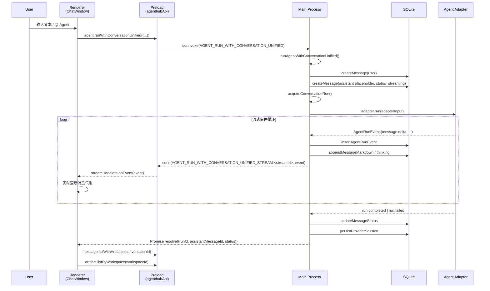

关键代码：

- 流式事件入口：`src/main/services/agentRunWithConversationService.ts:972` 函数 `runAgentWithConversationUnified`。
- 流式事件驱动核心：`src/main/services/streamingRunService.ts:83` 函数 `runStreamingAgent`。
- IPC 桥接：`electron/preload.ts:108` 函数 `runAgentWithOptionalStream`（旧版）与 `:108` `runWithConversationUnified`（新版统一事件）。
- 协议通道：`src/shared/ipcChannels.ts` `AGENT_RUN_WITH_CONVERSATION_UNIFIED_STREAM` 模板字符串为 `${channel}:${streamId}`。

### 2.3 Electron 进程模型

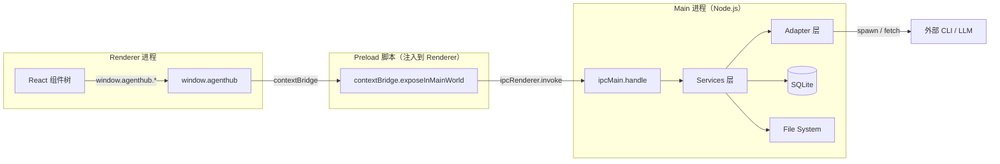

**关键约束**（见 `electron/main.ts:184-198`）：

- `contextIsolation: true`
- `nodeIntegration: false`
- `sandbox: false`（因 Preload 需 `require`，并被 `vite-plugin-electron` 编译为 `preload.cjs`）
- `preload: path.join(__dirname, "preload.cjs")`

这意味着 **Renderer 永远无法直接访问文件系统或 Node API**，所有本地能力都必须经 `window.agenthub.*` 触发主进程。

---

## 3. 核心数据模型与数据库设计

数据库初始化入口：`src/main/db/index.ts`。Schema 定义：`src/main/db/schema.ts`（共 14 张表 + 9 个 ensure 迁移）。WAL 模式 + `foreign_keys = ON`（`src/main/db/index.ts:54-55`）。

### 3.1 表关系总览

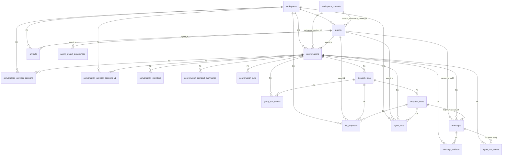

### 3.2 核心表字段速查

#### `workspaces`
- `id` PK、`name`、`rootPath`、`mainAgentId`、`gitEnabled`、`createdAt`、`updatedAt`。
- Schema：`src/main/db/schema.ts:413-422`。

#### `workspace_contexts`（v2 解耦设计）
- `id` PK、`ownerType`（`agent` / `group` / `conversation` / `legacy_workspace`）、`ownerId`、`rootPath`、`gitEnabled`。
- 索引：`idx_workspace_contexts_owner`、`idx_workspace_contexts_root_path`。
- 目的：让每个 Agent / 群聊 / 会话都能挂自己的 rootPath，避免"workspaceId 等于 rootPath"的旧耦合。
- Schema：`src/main/db/schema.ts:424-435`。

#### `agents`
- `id` PK、`workspaceId` FK、`defaultWorkspaceContextId`、`avatar`、`name`、`description`、`role`（`main` / `sub`，见 `src/shared/domain.ts:59`）、`type`（`orchestrator` / `specialist`，见 `:61`，通过 `ensureAgentTypeColumn` 迁移）、`runtimeProvider`、`systemPrompt`、`capabilities`（JSON 字符串）、`skillIds`（JSON 字符串数组）、`tools`（JSON）、`fileScope`、`status`、`createdAt`、`updatedAt`。
- 唯一索引：`idx_agents_one_main_per_workspace ON agents(workspace_id) WHERE role = 'main'`——保证每个 workspace 最多一个主 Agent。
- Schema：`src/main/db/schema.ts:439-457`。
- 类型定义：`src/shared/domain.ts:113-135`。

#### `conversations`
- `id` PK、`workspaceId` FK、`workspaceContextId`、`agentId` FK、`avatar`、`status`（`active` / `archived`）、`lastMessageAt`、`title`、`mode`（`single` / `main_agent_setup`，见 `src/shared/domain.ts:186`）、`type`（`direct` / `group`）、`description`、`ownerUserId`、`mainAgentId`、`autoDispatchEnabled`、`provider`（`RuntimeProvider`）。
- 重要迁移：`ensureConversationGroupColumns`（`schema.ts:19-42`）追加 type/description/owner_user_id/main_agent_id/auto_dispatch_enabled 五列。
- Schema：`src/main/db/schema.ts:459-473`。

#### `messages`
- 基础字段 + `status`（`streaming` / `completed` / `failed` / `cancelled`，见 `src/shared/groupChat.ts:24`）+ `mentionAgentIds` + `dispatchRunId` + `dispatchStepId` + `replyToMessageId` + `updatedAt` + `metadata` + `content_markdown` + `thinking_markdown`（v2 增量字段）。
- Schema：`src/main/db/schema.ts:475-486` + 迁移 `ensureMessageGroupColumns` / `ensureMessageMetadataColumn` / `ensureMessageContentMarkdownColumn` / `ensureMessageThinkingMarkdownColumn`。
- 思考过程（reasoning）与正文分离的字段：`thinking` / `thinking_markdown`（`src/shared/domain.ts:316`）——模型把 `<think>...</think>` 块以普通文本形式塞进 SSE 流时，`ThinkBlockParser`（`src/main/services/thinkBlockParser.ts`）会把块内文字剥到 `thinking_markdown`，块外继续写到 `content_markdown`。

#### `diff_proposals`
- 核心字段：`id`、`workspaceId`、`agentId`、`conversationId`、`filePath`、`oldContentHash`、`newContentHash`、`diffContent`、`newContent`、`status`（`pending` / `applied` / `rejected` / `conflicted` / `failed`，见 `src/shared/diff.ts:5`）、`createdAt`、`appliedAt`。
- v2 增量字段：`dispatchRunId` / `dispatchStepId` / `messageId`（`ensureDiffProposalGroupColumns`，`schema.ts:73`）。
- 类型定义：`src/shared/diff.ts:10-26`。

#### `artifacts`
- 字段：`id`、`workspaceId`、`agentId`、`conversationId`、`name`、`artifactType`（`code` / `html` / `markdown` / `diff` / `document` / `presentation` / `pdf`）、`filePath`、`content`、`metadata`、`createdAt`、`updatedAt`。
- 类型定义：`src/shared/artifact.ts:41-54`。

#### `dispatch_runs`（群聊调度运行）
- 关键字段：`id`、`conversationId`、`triggerMessageId`、`mode`（`mention` / `auto_dispatch` / `main_direct`）、`status`（见 `src/shared/groupChat.ts:28`：`planning` / `plan_created` / `running_subagents` / `reviewing` / `redispatching` / `completed` / `partial` / `partial_failed` / `failed` / `waiting_for_user`）、`maxSteps`（默认 30，`MAX_DISPATCH_STEPS = 30`，`src/shared/groupChat.ts:4`）、`roundIndex`、`acceptanceCriteria`（JSON）、`orchestratorReview`（JSON）、`finalSummaryEnabled`、`diffReviewRequired`。
- Schema：`src/main/db/schema.ts:591-606`。

#### `dispatch_steps`
- 字段：`id`、`dispatchRunId` FK、`stepIndex`、`agentId` FK、`instruction`、`status`（`pending` / `queued` / `running` / `streaming` / `completed` / `partial` / `failed` / `iteration_limit_reached` / `waiting_for_permission` / `cancelled` / `skipped`，见 `src/shared/groupChat.ts:52-56`）、`roundIndex`、`assignmentId`、`targetCriteria`（JSON）、`subagentResult`（JSON）、`maxIterations`（默认 15，即 `AGENT_EXECUTION_LIMITS.groupSubagentMaxIterations`，`src/shared/agentExecution.ts:3`）、`inputContextSnapshot`（JSON）、`outputMessageId`、`errorMessage`、`startedAt`、`finishedAt`。
- Schema：`src/main/db/schema.ts:610-629`。

#### `conversation_provider_sessions`（v1 / v2 双表）
- v1：`id` PK、`conversationId` + `provider` + `root_path` 组成 UNIQUE（`ensureProviderSessionUpsertIndex`，`schema.ts:338-351`），用于"按 (conversation, provider, rootPath) 唯一"语义。
- v2：`id` PK、`conversationId` + `agentId` + `provider` + `workspaceContextId` + `rootPath` + `executionScope` 联合索引——更精细：相同 conversation 下，不同 agent 或不同 executionScope 可以各自有独立的 Provider 会话。

#### `agent_runs`
- 字段：`id`、`conversationId`、`workspaceId`、`agentId`、`provider`、`providerSessionId`、`rootPath`、`systemPromptSnapshot`、`toolPermissionsSnapshot`、`status`（`running` / `completed` / `failed` / `cancelled` / `waiting_for_permission` / `iteration_limit_reached` / `verification_failed`）、`mode`（`single_chat` / `group_subagent` / `orchestrator_review`）、`workspaceContextId`、`executionScope`、`dispatchStepId`、`maxIterations`（默认 40 / 15 / 5，对应 `singleChatMaxIterations` / `groupSubagentMaxIterations` / `orchestratorReviewMaxIterations`，见 `src/shared/agentExecution.ts:1-7`）、`iterationsUsed`、`rawOutput`、`startedAt`、`endedAt`、`errorMessage`、`usedFallback`。
- Schema：`src/main/db/schema.ts:681-706`。

#### `agent_run_events`（v2 统一事件流）
- 字段：`id`、`runId`、`conversationId` FK、`seq`、`type`（`run.started` / `message.started` / `message.delta` / `message.thinking_delta` / `message.completed` / `tool.call.started` / `tool.call.completed` / `tool.result` / `diff.proposal` / `artifact.created` / `artifact.rendered` / `command.result` / `file.reference` / `run.completed` / `run.failed`）、`payload_json`、`createdAt`。
- UNIQUE `(run_id, seq)`：保证事件可幂等持久化、可重放。
- Schema：`src/main/db/schema.ts:252-269`。

#### `group_run_events`（群聊事件流）
- 类似 `agent_run_events`，但 `group_run_id` 关联 `dispatch_runs`。
- Schema：`src/main/db/schema.ts:271-289`。

#### `message_artifacts`（消息关联产物）
- 字段：`id`、`messageId` FK、`conversationId` FK、`type`（`tool_call` / `tool_result` / `diff_proposal` / `artifact_preview` / `command_result` / `file_reference` / `error`，见 `src/shared/agentRunEvent.ts:143-150`）、`payload_json`、`createdAt`。
- Schema：`src/main/db/schema.ts:293-311`。

#### `conversation_runs`（运行锁的持久化层）
- 字段：`id`、`conversationId`、`agentId`、`status`（`running` / `completed` / `failed` / `cancelled`）、`startedAt`、`endedAt`、`errorMessage`。
- 部分 UNIQUE 索引 `idx_conversation_runs_active ON conversation_runs(conversation_id) WHERE status = 'running'`——保证同一 conversation 同时只有一个 running 行，DB 层强约束。
- Schema：`src/main/db/schema.ts:314-336`。

#### `agent_project_experiences`（群聊经验沉淀）
- 字段：`id`、`agentId` FK、`groupConversationId` FK（指向群聊 conversation）、`groupName`、`summary`、`responsibilities_json`、`key_decisions_json`、`files_touched_json`、`diff_summaries_json`、`unresolved_issues_json`、`createdAt`、`updatedAt`。
- UNIQUE `(agent_id, group_conversation_id)`：每个 Agent 在每个群聊中只保留一条经验。
- Schema：`src/main/db/schema.ts:711-731`。
- 服务层：`src/main/services/agentProjectExperienceService.ts` 在每次群聊执行后用 LLM 总结 delta 并 upsert。

#### `conversation_compact_summaries`（长上下文压缩摘要）
- 字段：`id`、`conversationId` FK、`coveredMessageStartId`、`coveredMessageEndId`、`summary`、`summaryTokens`、`rawTokensBeforeCompact`、`createdAt`、`updatedAt`。
- Schema：`src/main/db/schema.ts:535-549`。

#### 其他表
- `conversation_members`：群聊成员表，类型 `user` / `agent`，角色 `owner` / `main_agent` / `member`，`UNIQUE(conversation_id, member_type, member_id)`，见 `schema.ts:577-587`。
- `agent_drafts`：**保留兼容性的旧表**，新流程已不再写入，但保留以避免破坏旧数据库（`schema.ts:551-575` 注释 "Keep old databases readable without exposing the retired draft workflow"）。
- `agents` / `conversations` 的增量列（`runtime_provider` / `claude_code_config` / `model_provider_id` / `model` / `avatar` / `workspace_context_id` 等）通过多个 `ensure*` 函数逐步添加，体现"加法迁移"策略。

### 3.3 Agent 与技能模型

- **主 Agent**（`role = "main"`、`type = "orchestrator"`）：每个 workspace 唯一（DB 唯一索引），负责单聊对话 + 群聊编排。`ensureDefaultMainAgent` 在 `electron/main.ts:600` 启动时调用。
- **子 Agent**（`role = "sub"`、`type = "specialist"`）：由用户在 Add Sub Agent 对话框手动创建（`src/renderer/features/agents/AddSubAgentDialog.tsx`），绑定到 `workspaceId` 或 `defaultWorkspaceContextId`。
- **技能点**（`skillIds`：JSON 数组，类型 `category/skill-name`）：从仓库根目录 `skills/<category>/<skill-name>/skill.md` 加载（`src/main/services/agentSkillCatalogService.ts:32`），形成 Agent 的能力描述。技能点分 8 大类（`AGENT_SKILL_CATEGORIES`，`agentSkillCatalogService.ts:10`）。
- **工具权限**（`AgentToolPermissions`，`src/shared/domain.ts:77-85`）：`readFile` / `writeDiff` / `applyDiff` / `previewArtifact` / `gitStatus` / `webSearch` / `webFetch`，其中 `applyDiff` **恒为 false**（仅供 UI Apply 按钮调用），见 `src/main/services/toolPermissionService.ts:67`。
- **Provider 会话**：通过 `conversation_provider_sessions` 持久化 `provider_session_id`，下次同会话可尝试续接（`src/main/services/agentRunWithConversationService.ts:416-431`）。

### 3.4 会话与消息模型

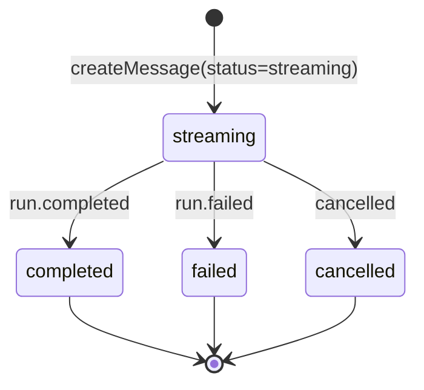

- 单聊会话：每个 Agent 默认有一个 `Default Chat`（`DEFAULT_MAIN_CONVERSATION_TITLE = "Default Chat"`，`src/main/services/conversationService.ts:20`），并通过 `ensureMainAgentGuideMessage`（`conversationService.ts:35`）写一条系统引导消息。
- 群聊会话：`type = "group"`，包含 `conversation_members` 记录成员，并设置 `main_agent_id`（主 Agent）、`auto_dispatch_enabled`（是否自动分派）。
- 消息类型（`MessageType`，`src/shared/domain.ts:248-258`）：`text` / `code` / `diff_card` / `file_card` / `preview_card` / `deploy_status` / `agent_status` / `dispatch_plan` / `agent_assignment` / `orchestrator_summary`。
- 消息状态（`MessageStatus`，`src/shared/groupChat.ts:24`）：`streaming` / `completed` / `failed` / `cancelled`。
- 消息关联产物：旧字段 `dispatchRunId` / `dispatchStepId` / `replyToMessageId`（`schema.ts:55-66` 迁移新增）+ 新表 `message_artifacts`（`schema.ts:292-311`）双轨。

### 3.5 群聊调度模型

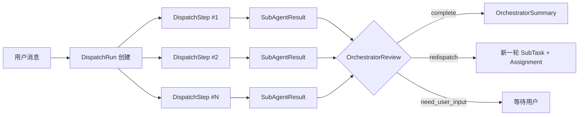

- 一次群聊消息触发**一个** `DispatchRun`（`src/main/services/dispatchService.ts:3170` `createDispatchRun`）。
- 每个子 Agent 任务对应一个 `DispatchStep`（含 `assignmentId` / `targetCriteria` / `subagentResult` / `inputContextSnapshot`）。
- `roundIndex` 支持**多轮分派**：第一轮失败后 Orchestrator 可要求 redispatch，产生 `roundIndex + 1` 的新一轮 steps。
- `orchestratorReview` 字段保存本轮评审结果（`decision: complete | redispatch | need_user_input | partial | failed`，见 `src/shared/groupChat.ts:258`）。
- `group_run_events` 表记录 7 类事件（`plan_created` / `agent_started` / `agent_progress` / `agent_completed` / `agent_failed` / `summary_started` / `summary_completed`，`src/shared/groupChat.ts:407-414`）用于前端实时渲染。

### 3.6 产物与 Diff 模型

- **Artifact**：Agent 输出（HTML / Markdown / 文档 / PDF / PPT）的容器。`artifactRenderService`（`src/main/services/artifactRenderService.ts`）支持 LibreOffice 转换、iframe 预览。
- **DiffProposal**：代码修改的统一提案。在 `applyDiff` 之前只存在 DB 中；`applyDiff` 通过 `applyUnifiedDiffToContent`（`src/main/services/diffProposalTextService.ts:45`）或 `createDiffProposalFromText`（解析 SEARCH/REPLACE 块）应用到磁盘。
- **绑定关系**：`diff_proposals.dispatch_run_id` / `dispatch_step_id` / `message_id` 三个外键软关联（`schema.ts:73-88`），让 Diff 可以追溯到具体的群聊 step 或消息。

---

## 4. 前端技术设计

### 4.1 三栏工作台实现

`src/renderer/App.tsx` 是顶层布局：

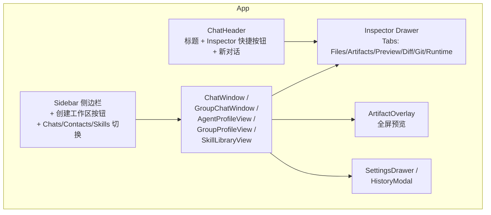

关键代码：

- 顶层壳：`src/renderer/App.tsx:40-504`。
- Inspector Tab 列表：`src/renderer/App.tsx:28` `inspectorTabs = ["Files", "Artifacts", "Preview", "Diff", "Git", "Runtime"]`。
- 跨组件事件总线：`window.dispatchEvent(new CustomEvent("agenthub:open-artifact", { detail }))`，订阅方在 `App.tsx:190-211` 监听并打开 Inspector。

### 4.2 单聊页面实现

`src/renderer/features/chat/ChatWindow.tsx`（主入口）：

- 接收 `activeConversation` / `activeAgent`。
- 加载消息：`api.message.listWithArtifacts(conversationId)` → 合并为 `ChatMessage[]`（带 `deliveryState` / `artifacts` / `pending` 状态）。
- 发送消息：调用 `api.agent.runWithConversationUnified(...)`，注册 `streamHandlers.onEvent` 接收 `AgentRunEvent`，按事件类型分别：
  - `message.delta` → 追加到当前正在 streaming 的 assistant message 的 `text` 字段。
  - `message.thinking_delta` → 追加到 `thinking` 字段（折叠块）。
  - `diff.proposal` → 通过 `window.dispatchEvent("agenthub:open-diff")` 打开 Inspector Diff tab。
  - `artifact.created` → 通过 `window.dispatchEvent("agenthub:open-artifact")` 打开 Preview tab。
  - `tool.call.completed` / `command.result` / `file.reference` → 作为 message artifact 持久化到本地 `ChatMessage.artifacts`。
- 输入组件：`MessageComposer`（`src/renderer/features/chat/MessageComposer.tsx`），支持文本输入 + 附件。
- 流式渲染：`MessageList` 渲染每条 `ChatMessage`，根据 `messageType` 走 `MessageRenderer`（见 §4.5）。

### 4.3 群聊页面实现

`src/renderer/features/chat/GroupChatWindow.tsx`：

- 成员展示：`GroupMemberStrip`（顶部横条）+ `GroupMemberPanel`（左侧侧边栏）。
- 输入：`MentionInput`（`src/renderer/features/chat/MentionInput.tsx`）支持 `@AgentName` 语法，会把选中的 Agent id 一起发给主进程。
- 实时状态：`GroupRunTimeline`（`src/renderer/features/chat/GroupRunTimeline.tsx`）订阅 `dispatch_stream:<streamId>` 事件，渲染 DAG 状态面板。
  - `dispatch_step_update` → 更新 step 卡片。
  - `dispatch_plan_message` → 插入 dispatch_plan 卡片。
  - `group_run_event` → 渲染 `plan_created` / `agent_started` / `agent_progress` / `agent_completed` / `agent_failed` / `summary_started` / `summary_completed` 七种事件。
- DispatchPlan 渲染：`DispatchPlanMessage`（`renderers/DispatchPlanMessage.tsx`）展示第 N 轮分派计划，包括每个 Agent 的 score / capability / reason。

### 4.4 通讯录与技能仓库实现

- **Sidebar**：`src/renderer/features/sidebar/Sidebar.tsx` 提供 `chats` / `contacts` / `skills` 三个区段切换，置顶会话持久化到 `localStorage` 的 `agenthub:pinned-conversation-ids` 键。
- **Agent Profile**：`src/renderer/features/agents/AgentProfileView.tsx`（467 行）：展示 Agent 名称 / 描述 / Runtime / 技能点 / 默认 Workspace Context / 加入的群聊列表 / 项目经验。
- **添加子 Agent**：`src/renderer/features/agents/AddSubAgentDialog.tsx`：表单 + 技能多选（`SkillMultiSelect`）+ 创建后自动跳转到新 Agent 的单聊。
- **创建群聊**：`src/renderer/features/groups/CreateGroupDialog.tsx` + 群成员选择（`AgentPickerDialog` / `AgentPickerList`）。
- **技能仓库**：`src/renderer/features/skills/SkillLibraryView.tsx` + `agentSkillCatalogService.listSkills()`（按 8 大类分组），支持技能详情查看。

### 4.5 消息与产物渲染系统

`src/renderer/features/chat/MessageRenderer.tsx` 是分派中心，按 `messageType` 选择对应渲染器：

| messageType | 渲染器 | 文件 |
| --- | --- | --- |
| `text` | `TextMessage` + 可选 `ThinkingBlock` | `renderers/TextMessage.tsx` / `ThinkingBlock.tsx` |
| `code` | `CodeMessage` | `renderers/CodeMessage.tsx` |
| `diff_card` | `DiffCardMessage` | `renderers/DiffCardMessage.tsx` |
| `agent_status` | `AgentStatusMessage` | `renderers/AgentStatusMessage.tsx` |
| `dispatch_plan` | `DispatchPlanMessage` | `renderers/DispatchPlanMessage.tsx` |
| `agent_assignment` | `AgentAssignmentMessage` | `renderers/AgentAssignmentMessage.tsx` |
| `orchestrator_summary` | `OrchestratorSummaryMessage` | `renderers/OrchestratorSummaryMessage.tsx` |
| `file_card` / `preview_card` / `deploy_status` | `PlaceholderMessage` | `MessageRenderer.tsx:110-126`（占位实现） |
| `agent_config_card` | `LegacyAgentConfigCardMessage` | `MessageRenderer.tsx:102-108`（**保留兼容旧消息**） |

- 文本渲染：`TextMessage` 用 `react-markdown` + `remark-gfm` + `rehype-sanitize`，`CodeBlock`（`CodeBlock.tsx`）用 `highlight.js`。
- Thinking 块：`ThinkingBlock` 默认折叠，点击展开。来源于 `ThinkBlockParser`（`src/main/services/thinkBlockParser.ts`）在主进程把 `<think>...</think>` 剥到 `thinking_markdown` 字段。

### 4.6 前端状态管理

`src/renderer/state/workspaceStore.ts` 是一个**单一全局 store + 订阅**模型（`useSyncExternalStore`）。

- 状态字段（`WorkspaceStoreState`，第 50-77 行）共 30+ 字段。
- 核心 action：
  - `loadWorkspaces` / `loadWorkspaceTree` / `loadHubCollections`：启动时拉取 workspace、agent、conversation tree，以及 contacts / chats / groupChats 三个集合。
  - `createSubAgentManually` / `deleteSubAgent` / `deleteWorkspace`：用户操作后自动 refresh tree。
  - `selectChat` / `openAgentContact` / `openGroupContact`：UI 路由状态机。
  - `setConversationMessages` / `setConversationSending` / `setConversationActiveRunId`：消息级状态。
  - `createGroupConversationAction` / `addGroupMemberAction` / `removeGroupMemberAction`：群聊成员管理。
- 持久化：置顶 conversation id 写到 `localStorage`（`Sidebar.tsx:17-41`）。

---

## 5. 主进程服务设计

### 5.1 主进程服务总览

`src/main/services/` 下共 40+ 文件，按职责分：

| 目录 | 文件 | 职责 |
| --- | --- | --- |
| 根 | `agentService.ts` | Agent 创建 / 维护 / 删除 / 默认主 Agent / 配置文件 |
| 根 | `agentBootstrapService.ts` | `ensureDefaultMainAgent` 启动时确保主 Agent 存在 |
| 根 | `agentDeletionService.ts` | Agent 删除 + 关联资源清理 + 可选 workspace 目录 trash |
| 根 | `agentRunService.ts` | 旧版 `runAgent` 入口（保留兼容） |
| 根 | `agentRunWithConversationService.ts` | 新版 `runAgentWithConversation` + `runAgentWithConversationUnified` |
| 根 | `streamingRunService.ts` | **流式事件统一驱动核心** |
| 根 | `dispatchService.ts` | 群聊调度（`handleGroupUserMessage` / `dispatchGroupTasks` / `retryDispatchStep`） |
| 根 | `groupExecutionService.ts` | 群聊执行（`parseSubAgentResult` / `reviewAcceptanceCriteria`） |
| 根 | `mainAgentDecision.ts` | 主 Agent LLM 输出解析（`parseMainAgentDecision`） |
| 根 | `orchestratorSystemPrompt.ts` | 主 Agent / 群聊编排者提示词构造 |
| 根 | `orchestratorRuntimeService.ts` | 群聊 Orchestrator 决策 + 汇总 + 能力裁判 |
| 根 | `mainAgentContextService.ts` | 主 Agent 上下文 payload 构造 |
| 根 | `mainAgentFileTools.ts` | 主 Agent 文件工具（`MAIN_AGENT_FILE_TOOLS`） |
| 根 | `modelProviderService.ts` | Provider 配置（保存 / 测试 / 列出） |
| 根 | `runtimeService.ts` | Runtime 健康检查（`codex --version` / `claude --version`） |
| 根 | `llmRouter.ts` | LLM 调用 + 流式解析 + 续接 |
| 根 | `llmProviderAdapters.ts` | OpenAI / Anthropic 协议适配 |
| 根 | `sseParser.ts` | SSE 帧解析 |
| 根 | `thinkBlockParser.ts` | `<think>...</think>` 块剥离 |
| 根 | `tokenEstimator.ts` | 简单 token 估算 |
| 根 | `diffService.ts` | Diff 提案 / Apply / Reject |
| 根 | `diffProposalTextService.ts` | 从 LLM 文本中解析 SEARCH/REPLACE 块 |
| 根 | `artifactService.ts` | 产物创建 / 持久化 / 转换调度 |
| 根 | `artifactRenderService.ts` | 产物渲染（HTML iframe / LibreOffice） |
| 根 | `artifactDiffService.ts` | 产物 → DiffProposal 转换 |
| 根 | `fileService.ts` | 文件树 / 文件读取 / 写入（带 PathGuard） |
| 根 | `gitService.ts` | Git status / diff（`execFile` 调 git） |
| 根 | `conversationService.ts` | 单聊会话创建 / 删除 / 默认会话 / 引导消息 |
| 根 | `groupChatService.ts` | 群聊创建 / 成员 / 群 Profile |
| 根 | `messageService.ts` | 消息创建 / 列表 |
| 根 | `workspaceService.ts` | Workspace 创建 / 准备 / 校验 |
| 根 | `workspaceContextResolver.ts` | 解析 `WorkspaceContext`（v2 解耦） |
| 根 | `navigationService.ts` | 三栏 tree 数据（`getNavigationTree`） |
| 根 | `configService.ts` | 加载 `.agenthub/config.json`（Provider / Limits） |
| 根 | `toolPermissionService.ts` | 工具权限校验（`assertAgentCanUseTool`） |
| 根 | `memoryContextService.ts` | 上下文记忆层（直接记忆 / 群聊记忆） |
| 根 | `agentSkillCatalogService.ts` | 技能目录加载 + Agent 技能描述构造 |
| 根 | `agentProjectExperienceService.ts` | 群聊项目经验更新 |
| 根 | `conversationRunLock.ts` | 单会话运行锁（DB 唯一索引 + 内存 Map） |
| 根 | `localRuntimeRunner.ts` | Claude Code / Codex CLI 子进程运行（旧版） |
| 根 | `webToolService.ts` | Web 搜索 / 抓取 |
| `adapters/` | `builtinAgentAdapter.ts` | 内置 HTTP LLM Adapter（OpenAI / Anthropic） |
| `adapters/` | `claudeCodeAdapter.ts` | Claude Code CLI Adapter |
| `adapters/` | `codexAdapter.ts` | Codex CLI Adapter |
| `adapters/` | `openCodeAdapter.ts` | OpenCode CLI Adapter |
| `adapters/` | `unifiedAgentProviderAdapter.ts` | **统一事件协议包装层** |
| `adapters/` | `index.ts` | `getAdapter` / `getUnifiedProviderAdapter` 工厂 |
| `dispatch/` | `agentScoring.ts` | 评分 / DAG 批 / 工具匹配 / 能力兜底 |
| `dispatch/` | `mentionParser.ts` | `@Agent` 解析 |

### 5.2 Agent 与会话服务

- **创建主 Agent**：`agentService.createMainAgentForWorkspace`（`agentService.ts` 后续）+ `agentBootstrapService.ensureDefaultMainAgent`（`agentBootstrapService.ts:1`，`electron/main.ts:600` 调用）—— 启动时确保存在一个 role=main / type=orchestrator 的 Agent。
- **创建子 Agent**：`api.agent.createSubAgentManually`（`electron/main.ts:285`）→ `agentService.createSubAgentManually` → 同步创建第一个 `direct` conversation（`CreateSubAgentManuallyOutput`）。
- **更新 Agent**：`api.agent.updateProfile` / `updateStatus` / `updateDefaultWorkspace` / `delete`。
- **单聊自动创建**：`agentRunWithConversationService.createConversation`（`agentRunWithConversationService.ts:355`）—— 用户首次发消息时若没传 `conversationId` 则自动创建。
- **群聊创建**：`groupChatService.createGroupConversation`（`groupChatService.ts:126`）开启 SQLite 事务：创建 conversation、添加 owner + main_agent + member 三种 `conversation_members`、创建 `workspace_contexts`。
- **会话历史**：`conversationService.listChats` / `listConversationsByAgent` / `findOrCreateDirectConversationForAgent`。
- **置顶 / 归档 / 搜索**：置顶由前端 `localStorage` 实现（`Sidebar.tsx:17`），归档字段 `conversations.status` 预留但 UI 未暴露搜索/归档入口（"当前版本未实现"）。

### 5.3 消息与流式事件服务

统一流式入口：`streamingRunService.runStreamingAgent`（`streamingRunService.ts:83`）。

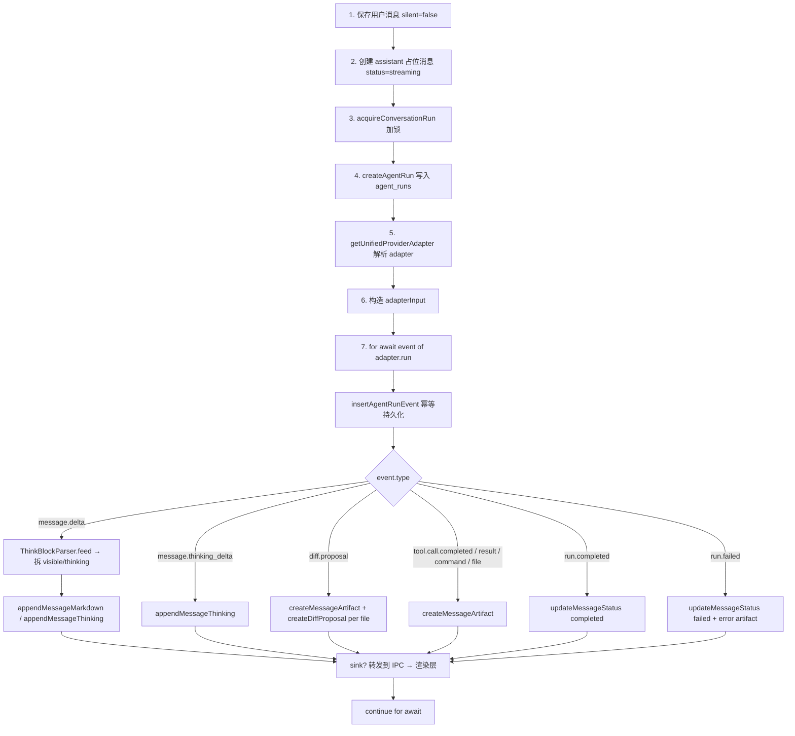

- 锁释放：`runLock.release("completed" | "cancelled")` 或 `runLock.fail(error)`，在 `finally` 中保证执行（`streamingRunService.ts:396-405`）。
- Provider Session 续接：`streamingRunService.ts:163-178` 调用 `getActiveProviderSession` 查活跃 session，把 `providerSessionId` 传给 adapter。
- 持久化事件：`insertAgentRunEvent`（`src/main/db/repositories/agentRunEventRepo.ts`）依赖 UNIQUE `(run_id, seq)` 索引保证幂等。

旧版入口（保留兼容）：`agentRunWithConversationService.runAgentWithConversation`（`agentRunWithConversationService.ts:270`）直接消费 adapter `AgentEvent` 流（旧协议），`createDiffProposalFromText`（`diffProposalTextService.ts`）把 LLM 文本里的 SEARCH/REPLACE 块解析成 DiffProposal。

### 5.4 Workspace 与文件服务

- **WorkspaceContext**：`src/main/services/workspaceContextResolver.ts:61` `resolveExecutionWorkspaceForAgentDirect` / `:resolveExecutionWorkspaceForGroup` / `:resolveExecutionWorkspaceForConversation` —— 三种入口分别解析 Agent / 群聊 / 会话的执行 workspace，优先级 `agent.defaultWorkspaceContextId` > `group workspace context` > `conversation.workspaceContextId` > `legacy_workspace`。
- **工作目录绑定**：`workspaceContextRepo`（`src/main/db/repositories/workspaceContextRepo.ts`）通过 `ownerType + ownerId` 唯一定位，确保每个 Agent / 群聊 / 会话有独立的 `rootPath`。
- **文件读取**：`fileService.readWorkspaceFile` → `fs.promises.readFile`（带 `MAX_FILE_PREVIEW_BYTES = 1MB`、二进制文件检测、`BINARY_SAMPLE_BYTES` 抽样）。
- **路径校验**：`utils/pathGuard.ts` `createWorkspacePathGuard` → `assertInsideWorkspace` 把任何外部路径（如 `../`、`/etc/passwd`）挡掉，错误码 `PATH_OUTSIDE_WORKSPACE`。
- **Workspace Root Guard**：`fileService.ts` / `diffService.ts` / `artifactService.ts` 全部在文件操作前调用 `assertAgentCanUseTool` + `createWorkspacePathGuard`。

### 5.5 Artifact 与 Diff 服务

- **Artifact 创建**：`artifactService.createArtifact`（`artifactService.ts`）写 `artifacts` 表 + 调度 `artifactRenderService.scheduleArtifactRender`（异步 LibreOffice / HTML 渲染）+ 通过 `setArtifactRenderNotifier` 推送 IPC 通知 `ARTIFACT_RENDER_CHANGED` 给 Renderer（`electron/main.ts:594-596`）。
- **Artifact 预览协议**：`electron/main.ts:218-247` 注册 `agenthub-preview://artifact/<artifactId>/<assetId>` 自定义协议，Renderer 用 `<iframe src="agenthub-preview://...">` 内联预览 HTML 产物。
- **DiffProposal 创建**：`diffService.createDiffProposal`（`diffService.ts:108`）支持 `newContent` 或 `unifiedDiff` 两种输入。
- **从 LLM 文本解析**：`diffProposalTextService.createDiffProposalFromText`（`diffProposalTextService.ts`）扫描 LLM 输出的 `SEARCH` / `REPLACE` 块，生成 DiffProposal（"修改文件" + "新建文件"两种场景都支持）。
- **Diff 审查**：用户在 UI 点击 `Apply` → `api.diff.apply` → `diffService.applyDiff` → 写文件 + `gitStatus`（`diffService.ts:120+`），状态变 `applied`，`appliedAt` 写入。
- **Reject**：`api.diff.reject` → `diffService.rejectDiffProposal` → 状态变 `rejected`。
- **冲突**：如果 apply 时文件已被改（hash 不匹配），状态变 `conflicted`，需要重新生成 DiffProposal。

### 5.6 群聊调度服务（核心）

详见 §7。

### 5.7 配置 / Provider / Runtime 健康

- **Provider 配置**：`modelProviderService.saveProvider` / `listProviders` / `testConnection` 存到 `agents.model_provider_id` / `model` 字段（v2 字段，`schema.ts:173` 迁移新增）。
- **Runtime 健康检查**：`runtimeService.checkRuntimeProvider`（`runtimeService.ts:30+`）用 `spawn('codex', ['--version'])` 等命令检查 CLI 是否可用，结果 `RuntimeStatus`（`available` / `unavailable` / 错误原因）推到前端显示。
- **配置加载**：`configService.loadMainAgentConfig(workspace.rootPath)` 读 `.agenthub/config.json`（`configService.ts`），提供 `MainAgentModelConfig`（Provider / API Format / Model / Limits 等）。

### 5.8 工具权限服务

`src/main/services/toolPermissionService.ts`：

- `assertAgentCanUseTool({ agentId, tool })`：检查 `agent.tools[tool] === true`，否则抛 `ToolPermissionServiceError`。
- `applyDiff` **始终拒绝**（无论 `agent.tools.applyDiff` 是什么），仅供 UI Apply 按钮调用（`toolPermissionService.ts:67-71`）。
- 在 `fileService` / `diffService` / `artifactService` / `agentFileTools` 全部先调用 `assertAgentCanUseTool`。

---

## 6. Agent Runtime 与多平台接入

### 6.1 Runtime 抽象设计

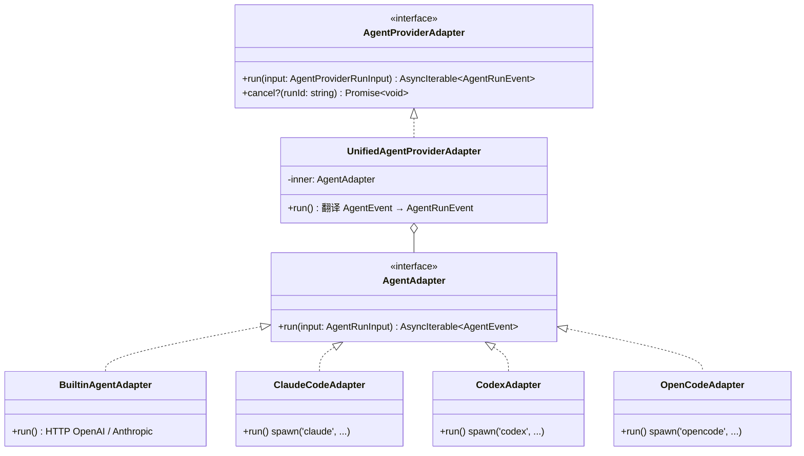

两层接口定义于 `src/shared/agentAdapter.ts`（`AgentAdapter`）和 `src/shared/agentRunEvent.ts`（`AgentProviderAdapter`）：

- **旧协议 `AgentEvent`**：`text_delta` / `reasoning_delta` / `provider_session` / `diff_proposal` / `structured_result` / `error` / `status`。`legacy runAgent` 路径仍在用。
- **新协议 `AgentRunEvent`**：`run.started` / `message.started` / `message.delta` / `message.thinking_delta` / `message.completed` / `tool.call.started` / `tool.call.completed` / `tool.result` / `diff.proposal` / `artifact.created` / `artifact.rendered` / `command.result` / `file.reference` / `run.completed` / `run.failed`。新 `runStreamingAgent` 路径在用。

### 6.2 Provider Adapter 详解

| Provider | 文件 | 接入方式 | 主要差异 |
| --- | --- | --- | --- |
| `builtin_openai` / `builtin_anthropic` | `adapters/builtinAgentAdapter.ts` | HTTP 直连 OpenAI 兼容 / Anthropic 兼容 API | 用 `llmProviderAdapters.ts` + `llmRouter.callLLM` / `callLLMWithContinuation` / `callLLMWithToolSupport`；支持 tool calling（`MAIN_AGENT_FILE_TOOLS`） |
| `claude_code` | `adapters/claudeCodeAdapter.ts` | `spawn('claude', [...])` 子进程 | 通过 `--append-system-prompt` 注入系统提示词；cwd 必须是 `workspace.rootPath` |
| `codex_local` | `adapters/codexAdapter.ts` | `spawn('codex', [...])` 子进程 | 通过 `--cd` 指定工作目录 |
| `opencode` | `adapters/openCodeAdapter.ts` | `spawn('opencode', [...])` 子进程 | 类似 codex |
| `mock` | `adapters/builtinAgentAdapter.ts`（分支） | Demo Agent Runner | `src/main/demo/demoAgentRunner.ts` |

`RuntimeProvider` 枚举：`src/shared/runtime.ts:4-10`：

```ts
type RuntimeProvider =
  | "codex_local"
  | "claude_code"
  | "opencode"
  | "mock"
  | "builtin_openai"
  | "builtin_anthropic";
```

`isBuiltinProvider`（`src/shared/runtime.ts:56`）判断是否走 HTTP LLM（而非 CLI）。

### 6.3 统一事件协议（`unifiedAgentProviderAdapter.ts`）

关键设计：

- 把任意 `AgentAdapter`（CLI 或 HTTP）的 `AgentEvent` 流**翻译**为 `AgentRunEvent` 流（`translateAgentEvent`，`unifiedAgentProviderAdapter.ts:78`）。
- 序列号 `seq` 单调递增，`run.started → message.started → ... → message.completed → run.completed | run.failed`。
- `provider_session` 不下发到 Renderer（仅作元数据，run service 在 `stream` 之后回写 DB）。
- 统一生命周期：
  ```mermaid
  sequenceDiagram
    participant U as UnifiedAdapter
    participant I as Inner Adapter
    U->>U: emit run.started
    U->>U: emit message.started
    loop translate
      I-->>U: AgentEvent
      U-->>U: translate to AgentRunEvent
    end
    U->>U: emit message.completed
    U->>U: emit run.completed
  ```

### 6.4 Runtime 健康检查与异常处理

`src/main/services/runtimeService.ts`：

- `RUNTIME_COMMANDS` 字典（`runtimeService.ts:31-47`）描述每个 CLI 的探活命令。
- `checkRuntimeProvider(provider)`：spawn → 3 秒超时（`CHECK_TIMEOUT_MS = 3000`）→ 收集 stdout/stderr → 提取版本号 → 返回 `RuntimeStatus`。
- 错误归一化：`normalizeSpawnError` / `normalizeExitError`（`runtimeService.ts:78+`）把 `ENOENT` → "command not found"，`EACCES` → "permission denied"，`127` → "command not found"。
- 输出截断：`MAX_CAPTURED_OUTPUT_LENGTH = 4096`（`runtimeService.ts:29`）。

异常处理矩阵：

| 异常 | 处理 |
| --- | --- |
| Provider 不可用 | `RuntimeStatus.available = false` + error message |
| 超时 | `CHECK_TIMEOUT_MS` 到点 kill 进程 |
| 输出截断 | 截到 4KB 头部 |
| 续接失败 | `runAdapterWithFallback`（`agentRunWithConversationService.ts:867`）catch `ResumeFailedError` → 标记旧 session 为 `failed` → 用 `buildFallbackPrompt` 重建上下文（基于历史消息） |
| 流式中断 | `runStreamingAgent` catch → 写 `run.failed` 事件 + error artifact + 更新 `agent_runs.status = "failed"` |
| LLM 输出异常 | `llmRouter` `LLMError` 含 telemetry（`llmRouter.ts:58`） |
| 上下文超限 | `conversationContextService.truncateToTokenBudget`（`conversationContextService.ts:61`）二分截断 |
| Diff 冲突 | `diffService.applyDiff` 写 `conflicted` 状态 |
| 会话并发 | `conversationRunLock` + DB 唯一索引（`schema.ts:328`） |

---

## 7. Orchestrator 群聊调度实现

### 7.1 核心数据流

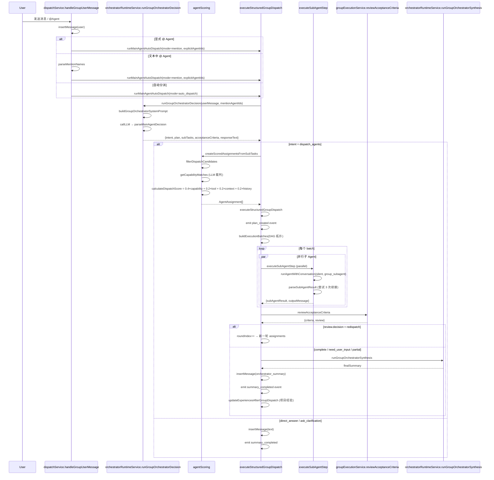

### 7.2 主 Agent 提示词与决策

- **单聊提示词**：`buildOrchestratorSystemPrompt`（`orchestratorSystemPrompt.ts:175`）由 `ROLE_PROMPT` + `CONSTRAINTS` + `OUTPUT_GUIDANCE` + 当前 Workspace + 已有 Agent + Skills + 最近消息组成。
- **群聊提示词**：`buildGroupOrchestratorSystemPrompt`（`orchestratorSystemPrompt.ts:279`）强调主 Agent **只拆任务不选 Agent**（"subTasks 不要选 agentId，系统会自动选择"），输出 `dispatch_agents` JSON 含 `subTasks` 数组。
- **意图解析**：`parseMainAgentDecision`（`mainAgentDecision.ts:296`）支持三种 `intent`：
  - `direct_answer`：Markdown 正文回复。
  - `ask_clarification`：澄清问题。
  - `dispatch_agents`：`plan` 包含 `subTasks` 数组（不指定 agentId）。
- 失败兜底：解析失败时强制视为 `direct_answer`（`mainAgentDecision.ts:317-340`），保证群聊不会因 LLM 偶尔输出非 JSON 而卡住。

### 7.3 子 Agent 选择与评分

`src/main/services/dispatch/agentScoring.ts`：

1. **硬过滤**：`filterDispatchCandidates`（`agentScoring.ts:121`）按顺序检查：
   - 是否群聊成员
   - 是否在用户显式 @ 候选池
   - role === "sub" && type === "specialist" && status ∈ {available, error}
   - 是否具备 requiredTools（用 `requiredToolNames` 把 `read_file` / `writeDiff` / `applyDiff` 等别名归一化）
2. **能力匹配**：`getCapabilityMatches`（`dispatchService.ts:921`）先按 `fallbackCapabilityMatch`（`agentScoring.ts:203`）做确定性分（tokenize 关键词重叠），再尝试调 LLM 裁判 `runGroupCapabilityMatchJudge`（`orchestratorRuntimeService.ts:656`）做语义分；LLM 失败时退回确定性分。
3. **工具匹配**：`calculateToolMatch`（`agentScoring.ts:179`）按 requiredTools × agent.tools 命中率算分。
4. **上下文相关性**：`getContextRelevance`（`dispatchService.ts:833`）根据该 Agent 在本群聊的历史 `agent_project_experiences`（`summary` / `responsibilities` / `filesTouched` 与当前 subTask 的 `taskType` / `targetFiles` 重合度）算分。
5. **历史可靠性**：`getHistoricalReliability`（`dispatchService.ts:869`）聚合 `dispatch_steps.status`（完成率 + 平均分）+ `diff_proposals` 接受率，按样本量加权（少于 10 次时往 0.6 靠拢，避免冷启动高分）。
6. **综合分**：`finalScore = 0.4×capability + 0.2×tool + 0.2×context + 0.2×history`（`agentScoring.ts:250-256`），clamp 到 [0,1]。
7. **Fallback 选择**：`selectBestScore`（`dispatchService.ts:975`）若最高分 < 0.55 且无显式 @，自动 fallback 到通用 Agent（"general" / "通用" / "全栈" / "full-stack" / "codex" / "coding" / "implementation" 名称命中）；有显式 @ 时不 fallback。

### 7.4 DAG 调度与执行顺序

`buildExecutionBatches`（`agentScoring.ts:291`）：

```mermaid
flowchart TB
  A1[SubTask A<br/>dependsOn: []]
  A2[SubTask B<br/>dependsOn: []]
  A3[SubTask C<br/>dependsOn: [A]]
  A4[SubTask D<br/>dependsOn: [A, B]]
  A5[SubTask E<br/>dependsOn: []]

  BATCH1[Batch 1: A, B, E]
  BATCH2[Batch 2: C]
  BATCH3[Batch 3: D]

  A1 --> BATCH1
  A2 --> BATCH1
  A5 --> BATCH1
  BATCH1 --> A3
  A3 --> BATCH2
  A2 --> A4
  A1 --> A4
  BATCH2 --> BATCH3
  BATCH2 --> A4
```

- 算法：每轮取所有 `dependsOn` 已完成（或无依赖）的 `SubTask`，组成一个 batch，batch 内通过 `Promise.all` 并行执行。
- **同文件写入防冲突**：`hasFileWriteConflict`（`agentScoring.ts:272`）如果两个 assignment 都 `expectedOutputType = "diff_proposal"` 且 `targetFiles` 有交集，则拆到不同 batch。
- 单 batch 用尽后还剩 pending（异常情况）→ 强制取第一个，递归继续（`agentScoring.ts:305-308`）。

### 7.5 子 Agent 执行与结果回传

`executeSubAgentStep`（`dispatchService.ts:1234`）逐 step 执行：

1. 加载 Agent + Workspace + 解析 Group WorkspaceContext。
2. 写 `dispatch_steps.status = "running"` + emit `agent_started` 事件。
3. **构造 SubAgentTaskInput**（`buildSubAgentTaskInput`，`dispatchService.ts:328`）—— 一个紧凑 JSON，字段：schemaVersion、taskId、dispatchRunId、dispatchStepId、parentMessageId、userGoal、assignedInstruction、assignedAgent、targetCriteria、constraints、allowedTools、workspace、relevantContext（selectedMessages / previousAgentOutputs / workspaceSummary / memorySummary）、expectedOutput。
4. 调 `buildGroupSubAgentMemoryContext`（`memoryContextService.ts`）注入该项目经验 + 摘要压缩 + 选定的 group messages。
5. 调 `runAgentWithConversation({ silent: true, mode: "group_subagent", structuredOutput: true, ... })` —— 在子 Agent 自己的单聊会话里跑（`getOrCreateAgentConversation`，`dispatchService.ts:1211`），避免污染群聊上下文。
6. 解析子 Agent 输出：`parseSubAgentResult`（`groupExecutionService.ts:146`）严格校验 `SubAgentResult` JSON 形状。
7. **续接机制**（`parseBestSubAgentResult` + `buildSubAgentContinuationPrompt` + `buildSubAgentManifestRepairPrompt`，`dispatchService.ts:439-622`）：
   - 输出被截断（`max_tokens` / `truncated` / `timed out`）→ 自动续接，最多 3 次（`MAX_SUB_AGENT_OUTPUT_CONTINUATIONS = 3`，`dispatchService.ts:119`）。
   - JSON 解析失败但有正文 → 把正文保存为 Markdown 产物（`LONG_DELIVERABLE_ARTIFACT_THRESHOLD = 1500` 字符以上，`dispatchService.ts:120`）→ 再调一次让 LLM 产出简短 SubAgentResult JSON。
8. **DiffProposal 校验**（`dispatchService.ts:1788-1852`）：
   - 校验 `diff_proposals.dispatch_run_id` / `dispatch_step_id` / `conversation_id` 全部匹配。
   - 校验如果 `filesChanged.length > 0` 必须有 `diffProposalId`，否则标 `failed`。
9. emit `agent_completed` / `agent_failed` 事件，插入 `agent_assignment` 类型的消息（带 `SubAgentResult` 完整内容到 `metadata`）。
10. 返回 `{ success, outputMessage, subAgentResult }`。

### 7.6 主 Agent 评审与汇总

- **评审**：`reviewAcceptanceCriteria`（`groupExecutionService.ts`）把 `AcceptanceCriterion` 按 `SubAgentResult.completedCriteria` / `unresolvedCriteria` 更新状态，决策 `complete` / `redispatch` / `need_user_input` / `partial` / `failed`。
- **多轮分派**：若 `decision = redispatch`，新一轮 `subTasks` 用 `roundIndex + 1`，再次评分 + DAG + 执行；最多 3 轮（`AGENT_EXECUTION_LIMITS.groupMaxRedispatchRounds = 3`，`src/shared/agentExecution.ts:4`）。
- **最终汇总**：`runGroupOrchestratorSynthesis`（`orchestratorRuntimeService.ts:495`）用 LLM 总结子 Agent 结果成"面向用户的最终答复"，强制约束"只输出最终答复正文，不要 JSON / 内部审核记录 / criterion ID / dispatch 状态 / 迭代预算 / Agent 执行日志"。失败兜底用 `createFallbackUserFacingSummary`。
- **项目经验沉淀**：`updateExperiencesAfterGroupDispatch`（`agentProjectExperienceService.ts`）根据本轮 `assignments` + `results` + `review` 用 LLM 提取 delta 并 upsert 到 `agent_project_experiences`（每个 Agent 在每个群聊保留一条经验记录）。

### 7.7 单 Agent 模式（runLegacyAutoDispatch / runMainAgentDirectReply）

`dispatchService.ts:2940-3230`：

- **LegacyAutoDispatch**：主 Agent 不是 orchestrator（如直接绑定了 `claude_code`）时，由主 Agent 自己输出 JSON DispatchPlan → 解析 → 单串行执行。
- **MainAgentDirectReply**：没有 mainAgent 时不调度，只让主 Agent 直接回复用户。

### 7.8 主 Agent Diff 审查

`runMainAgentDiffReview`（`dispatchService.ts:3386`）：

- 在群聊所有 step 完成后跑一次。
- 让主 Agent 审核所有 `diff_proposals`（按 `dispatch_run_id` 过滤）。
- 接受 → `pending`、拒绝 → `rejected`、冲突 → `conflicted`（多 Agent 改同一文件相近区域）。
- 最终 Apply 权仍在用户手里（提示词里强制"不要自动应用任何 DiffProposal"）。

---

## 8. 上下文、状态与安全机制

### 8.1 上下文管理

`src/main/services/conversationContextService.ts`：

- `buildConversationContextForAgentRun`（`conversationContextService.ts`）按 token 预算分配：
  - System prompt 区（`fitSystemContext`）：截断到预算。
  - Compact summary（`conversation_compact_summaries`）：已压缩历史。
  - 最近 N 条消息：按 `MESSAGE_OVERHEAD_TOKENS = 6` + `estimateTokens` 估算。
  - 工具调用：tool_calls + tool_results。
- `ContextBudget`（`conversationContextService.ts:16`）：`contextWindowTokens` / `reservedOutputTokens` / `safetyMarginTokens`（`DEFAULT_CONTEXT_SAFETY_MARGIN_TOKENS = 1024`）。
- 内置 LLM 才有 contextMessages，CLI Adapter 由 CLI 自己管理上下文。

### 8.2 上下文压缩与记忆

- **直接记忆（单聊）**：`buildDirectAgentMemoryContext`（`memoryContextService.ts`）把 `conversation_compact_summaries` + 最近 20 条消息拼成"Layered persisted memory"块注入 system prompt。
- **群聊子 Agent 记忆**：`buildGroupSubAgentMemoryContext`（`memoryContextService.ts`）额外加入：
  - Assignment 描述
  - 之前 subAgent 的输出摘要
  - 选定的 group messages
  - 群聊项目经验摘要
- **压缩摘要**：`compactDeterministically`（`memoryContextService.ts:71+`）当消息数超限时把"被覆盖的消息"压成 summary 存 `conversation_compact_summaries`。
- **项目经验**：`agentProjectExperienceService.updateExperiencesAfterGroupDispatch` 在群聊结束后用 LLM 总结 delta 并 upsert（`schema.ts:711-731`），下轮分派时通过 `getContextRelevance` 复用。

### 8.3 执行状态机

#### 单 Agent 状态

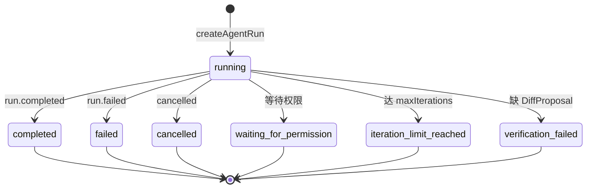

#### 群聊 DispatchRun 状态（`GroupRunStatus` / `DispatchRunStatus`，`src/shared/groupChat.ts:28-40`）

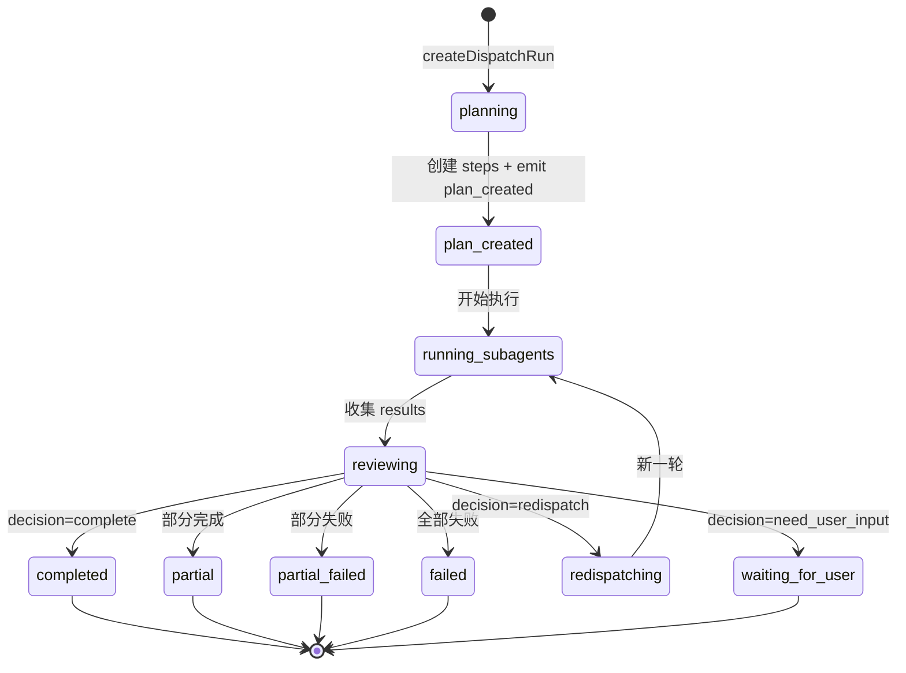

#### 群聊 DispatchStep 状态（`DispatchStepStatus`，`src/shared/groupChat.ts:52-56`）

`pending` / `queued` / `running` / `streaming` / `completed` / `partial` / `failed` / `iteration_limit_reached` / `waiting_for_permission` / `cancelled` / `skipped`。

#### Agent 资源状态（`AgentStatus`，`src/shared/domain.ts:63-70`）

`draft` / `available` / `running` / `error` / `unavailable` / `disabled` / `deleted`。

#### Runtime 健康状态（`RuntimeStatus`，`src/shared/runtime.ts:12-18`）

`available` / `unavailable` + `version` / `error` / `checkedAt`。

#### 五层状态映射

| 层 | 存储表 | 状态枚举 | UI 入口 |
| --- | --- | --- | --- |
| 资源 | `agents.status` | `AgentStatus` | `RuntimeBadge` / `AgentStatusBadge` |
| 健康 | 内存（`runtimeService`） | `RuntimeStatus` | `RuntimeSettings` Inspector Tab |
| 单聊 Run | `agent_runs.status` | `running` / `completed` / `failed` / `cancelled` | `AgentRunStepProcess` |
| 群聊 Run | `dispatch_runs.status` | `GroupRunStatus` | `GroupRunTimeline` |
| 群聊 Step | `dispatch_steps.status` | `DispatchStepStatus` | `GroupRunTimeline` 内 step 卡片 |

### 8.4 权限与安全控制

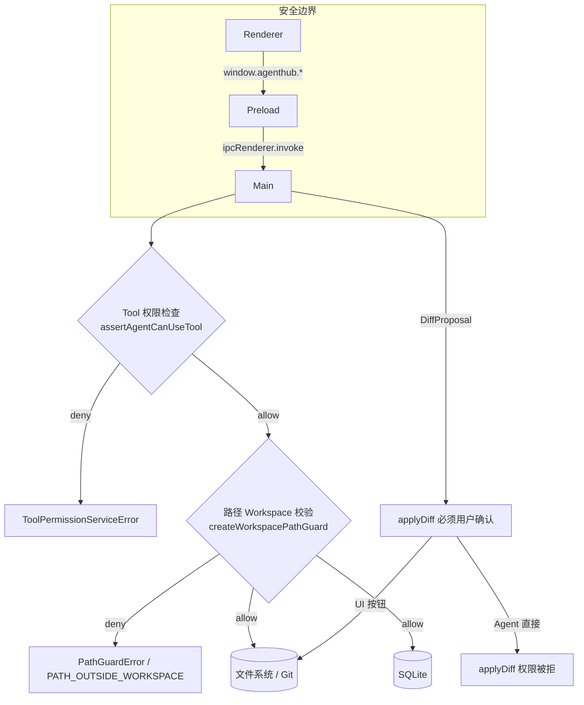

具体安全措施：

1. **Renderer 不直接访问文件系统**：所有 `fs.*` 调用都在主进程（`src/main/services/fileService.ts:readWorkspaceFile`）。
2. **Workspace Root Guard**：`utils/pathGuard.ts` 用 `path.resolve` + `relative` 计算是否在 `rootPath` 内，挡住 `..`、绝对路径、符号链接逃逸。
3. **工具权限**：`toolPermissionService.assertAgentCanUseTool` 在所有敏感操作前调用；`applyDiff` 永远 false（仅 UI 按钮可调）。
4. **DiffProposal 必须用户确认**：Agent 通过 `writeDiff` 工具产生的 DiffProposal 存到 `diff_proposals.status = pending`，只有 UI 上点击 Apply 才真正写盘（`diffService.applyDiff`）。
5. **文件系统权限错误**：`security blocked: File access outside workspace is not allowed.` 提示。
6. **会话并发锁**：`conversationRunLock` 内存 Map + DB 部分 UNIQUE 索引（`schema.ts:328`）双层防护。
7. **Provider 会话校验**：`isRuntimeProvider` / `ProviderMismatchError`（`src/shared/agentAdapter.ts:59`）防止 conversation 绑定的 provider 与 agent.runtimeProvider 不一致。
8. **续接失败降级**：`ResumeFailedError` → 标记旧 session 失败 → 用 `buildFallbackPrompt` 重建上下文（`agentRunWithConversationService.ts:867`）。
9. **审计日志**：`agent_runs.systemPromptSnapshot` / `toolPermissionsSnapshot` / `rawOutput` + `agent_run_events.payload_json` 全量持久化，可回放。
10. **OpenCode / Codex CLI sandbox**：依赖外部 CLI 自己的 sandbox 机制（未在 AgentHub 侧实现额外 sandbox）。

### 8.5 异常与降级策略

| 场景 | 降级策略 |
| --- | --- |
| Runtime 不可用 | 启动时 `runtime:check-all` 检测，结果写入 UI；运行时 `RuntimeStatus.available = false` 时 `agent.status = unavailable`（`schema.ts:99` 迁移把所有现存 Agent 标 unavailable），UI 仍可创建但运行会失败。 |
| 子 Agent 执行失败 | `executeSubAgentStep` catch → 标 `failed` + emit `agent_failed` + 写 `errorMessage`；其余 step 继续；汇总时 `partial_failed`。 |
| LLM 输出格式异常 | 群聊：`parseMainAgentDecision` 兜底为 `direct_answer`（`mainAgentDecision.ts:317`）；子 Agent：`parseSubAgentResult` 提取 JSON 块或 `firstBrace`/`lastBrace` 区间。 |
| 输出截断 | `parseBestSubAgentResult` 续接 3 次（`MAX_SUB_AGENT_OUTPUT_CONTINUATIONS`），最终以最后一次结果为准。 |
| 上下文超限 | `truncateToTokenBudget` 二分截断；超严重时 `dropped_tool_names` 让 LLM 重新生成 plan。 |
| Diff 冲突 | `applyDiff` 检查 `oldContentHash` 不匹配 → `status = conflicted` → UI 提示重新生成。 |
| 会话并发 | `ConversationAlreadyRunningError`（`agentAdapter.ts:70`）抛错给前端。 |
| LLM HTTP 错误 | `LLMError`（`llmRouter.ts:58`）含 telemetry，UI 渲染错误消息。 |
| Provider 会话失效 | `ResumeFailedError` → `runAdapterWithFallback` 重建上下文（`agentRunWithConversationService.ts:867`）。 |
| 任务评分失败 | LLM 裁判失败时回退到 `fallbackCapabilityMatch`（`agentScoring.ts:203`）。 |
| 编排者决策失败 | 群聊 catch 写 `orchestrator_dispatch_failure` 消息 + status `failed`（`dispatchService.ts:2899-2937`），含 `buildDispatchFailureHint` 提示重试。 |

### 8.6 已知限制 / 设计预留

- **检索 / 全文搜索**：Schema 中无 `search_index` 表，UI 没有暴露搜索/归档入口（"当前版本仅预留接口"）。
- **群聊结果文件回滚**：Diff 提案有 `rejected` 但没有"批量回滚"，需用户手动 apply / reject（"当前版本未完全实现"）。
- **Agent marketplace / 远程技能仓库**：技能目录只读 `skills/<category>/<skill-name>/skill.md`（`agentSkillCatalogService.ts:32`），不支持远程拉取。
- **多 Workspace 共享 Agent**：`listAgentContacts` + `agents` 不带 `workspaceId` 仍能查询跨 workspace 的 Agent，但 UI 主要按 workspaceId 过滤（"设计预留"）。
- **Provider 加密存储**：`apiKey` 在 `modelProvider` 表以明文存，依赖 SQLite 本地文件保护（"安全增强 TODO"）。

---

## 9. 附录：关键代码引用一览

### 9.1 IPC 通道（`src/shared/ipcChannels.ts`）

| 通道 | 用途 |
| --- | --- |
| `WORKSPACE_SELECT_FOLDER` / `WORKSPACE_PREPARE_CREATE` / `WORKSPACE_CREATE` / `WORKSPACE_LIST` / `WORKSPACE_DELETE` | Workspace 生命周期 |
| `AGENT_LIST_BY_WORKSPACE` / `AGENT_LIST_CONTACTS` / `AGENT_ENSURE_DEFAULT_MAIN_AGENT` / `AGENT_CREATE_SUB_AGENT_MANUALLY` / `AGENT_DELETE` / `AGENT_UPDATE_PROFILE` / `AGENT_UPDATE_STATUS` / `AGENT_UPDATE_DEFAULT_WORKSPACE` / `AGENT_GET_STATUS` / `AGENT_GET_PROFILE` | Agent 生命周期 |
| `SKILL_LIST_CATALOG` / `SKILL_GET` | 技能目录 |
| `AGENT_RUN` / `AGENT_RUN_WITH_CONVERSATION` / `AGENT_RUN_WITH_CONVERSATION_UNIFIED` | 同步 + 流式运行（带 `<streamId>` 模板后缀） |
| `RUNTIME_CHECK` / `RUNTIME_CHECK_ALL` | Runtime 健康检查 |
| `CONVERSATION_LIST_BY_AGENT` / `CONVERSATION_LIST_CHATS` / `CONVERSATION_RESOLVE_WORKSPACE_CONTEXT` / `CONVERSATION_FIND_OR_CREATE_DIRECT` / `CONVERSATION_CREATE_DIRECT` / `CONVERSATION_DELETE` | 会话 |
| `MESSAGE_LIST` / `MESSAGE_LIST_WITH_ARTIFACTS` / `MESSAGE_CREATE` | 消息 |
| `FILE_TREE` / `FILE_READ` | 文件 |
| `ARTIFACT_CREATE` / `ARTIFACT_LIST_BY_WORKSPACE` / `ARTIFACT_GET` / `ARTIFACT_RENDER` / `ARTIFACT_UPDATE_CONTENT` / `ARTIFACT_CREATE_DIFF` / `ARTIFACT_RENDER_CHANGED` | 产物（含推送通知） |
| `DIFF_CREATE_PROPOSAL` / `DIFF_GET` / `DIFF_LIST_BY_WORKSPACE` / `DIFF_APPLY` / `DIFF_REJECT` | Diff 审查 |
| `GIT_STATUS` / `GIT_DIFF` | Git |
| `GROUP_CONVERSATION_CREATE` / `GROUP_CONVERSATION_LIST` / `GROUP_CONVERSATION_LIST_ALL` / `GROUP_CONVERSATION_UPDATE_PROFILE` / `GROUP_CONVERSATION_UPDATE_WORKSPACE` / `GROUP_CONVERSATION_GET_PROFILE` / `GROUP_CONVERSATION_DELETE` / `GROUP_AVAILABLE_AGENT_LIST` | 群聊生命周期 |
| `GROUP_MEMBER_ADD` / `GROUP_MEMBER_ADD_MANY` / `GROUP_MEMBER_REMOVE` / `GROUP_MEMBER_LIST` | 群成员 |
| `GROUP_MESSAGE_SEND` / `GROUP_AGENT_LIST` / `GROUP_TASK_DISPATCH` | 群聊消息 + 调度 |
| `DISPATCH_RUN_GET` / `DISPATCH_RUN_LIST` / `DISPATCH_EVENT_LIST` / `DISPATCH_STEP_RETRY` / `DISPATCH_STREAM` | 调度查询 + 流式 |
| `MODEL_PROVIDER_LIST` / `MODEL_PROVIDER_GET` / `MODEL_PROVIDER_SAVE` / `MODEL_PROVIDER_DELETE` / `MODEL_PROVIDER_TEST` / `MODEL_PROVIDER_HAS_ANY` / `MODEL_PROVIDER_CONTEXT_USAGE` | Model Provider 配置 |
| `AGENT_RUN_EVENT_LIST` | 事件回放 |
| `NAVIGATION_GET_TREE` | 三栏 tree |
| `PING` | 主进程健康探活 |

### 9.2 关键枚举 / 类型

| 类型 | 位置 |
| --- | --- |
| `RuntimeProvider` | `src/shared/runtime.ts:4` |
| `AgentRole` / `AgentType` / `AgentStatus` | `src/shared/domain.ts:59-70` |
| `AgentToolPermissions` | `src/shared/domain.ts:77-85` |
| `ConversationType` / `ConversationMemberRole` / `ConversationMemberStatus` | `src/shared/groupChat.ts:6-12` |
| `MessageStatus` | `src/shared/groupChat.ts:24` |
| `DispatchMode` / `GroupRunStatus` / `DispatchRunStatus` / `SubAgentRunStatus` / `DispatchStepStatus` | `src/shared/groupChat.ts:26-56` |
| `AcceptanceCriterion` / `SubTask` / `CapabilityMatchResult` / `AgentDispatchScore` / `PreviousTaskSummary` | `src/shared/groupChat.ts:58-153` |
| `SubAgentResult` / `AgentAssignment` | `src/shared/groupChat.ts:154-195` |
| `SubAgentTaskInput` | `src/shared/groupChat.ts:223-255` |
| `OrchestratorReview` / `DispatchRun` / `DispatchStep` / `DispatchPlan` / `DispatchPlanStep` | `src/shared/groupChat.ts:257-313` |
| `MainAgentDiffReviewOutput` / `CreateGroupConversationInput` / `AddGroupMemberInput` / `SendGroupMessageInput` | `src/shared/groupChat.ts:322-385` |
| `GroupRunEventType` / `GroupRunPlanAssignment` / `GroupRunAgentEventPayload` / `GroupRunEvent` | `src/shared/groupChat.ts:407-519` |
| `DispatchStepUpdateEvent` / `DispatchPlanMessageEvent` / `GroupRunStreamEvent` / `DispatchRunStreamEvent` | `src/shared/groupChat.ts:521-544` |
| `AGENT_EXECUTION_LIMITS` | `src/shared/agentExecution.ts:1` |
| `AgentRunEventType` / `AgentRunEvent` / `MessageArtifact` | `src/shared/agentRunEvent.ts:18-159` |
| `ArtifactType` / `ArtifactRenderStatus` / `ArtifactRenderMode` | `src/shared/artifact.ts:1-19` |
| `DiffProposalStatus` / `DiffProposal` / `CreateDiffProposalInput` | `src/shared/diff.ts:3-48` |

### 9.3 关键函数

| 函数 | 位置 | 职责 |
| --- | --- | --- |
| `initializeDatabase` | `src/main/db/index.ts:38` | SQLite 启动 + WAL + schema |
| `acquireConversationRun` | `src/main/services/conversationRunLock.ts:39` | 会话运行锁（双层） |
| `runStreamingAgent` | `src/main/services/streamingRunService.ts:83` | **统一流式事件核心** |
| `runAgentWithConversationUnified` | `src/main/services/agentRunWithConversationService.ts:972` | 新版 IPC 入口 |
| `runAdapterWithFallback` | `src/main/services/agentRunWithConversationService.ts:867` | 续接失败降级 |
| `handleGroupUserMessage` | `src/main/services/dispatchService.ts:2325` | 群聊消息入口 |
| `executeStructuredGroupDispatch` | `src/main/services/dispatchService.ts:2095` | 群聊分派执行 |
| `executeSubAgentStep` | `src/main/services/dispatchService.ts:1234` | 单个 sub-agent 步骤 |
| `buildExecutionBatches` | `src/main/services/dispatch/agentScoring.ts:291` | DAG 拓扑 |
| `createScoredAssignmentsFromSubTasks` | `src/main/services/dispatchService.ts:1006` | 评分 + 选 Agent |
| `getCapabilityMatches` | `src/main/services/dispatchService.ts:921` | 能力匹配 |
| `runGroupOrchestratorDecision` | `src/main/services/orchestratorRuntimeService.ts:424` | 主 Agent 决策 |
| `runGroupOrchestratorSynthesis` | `src/main/services/orchestratorRuntimeService.ts:495` | 最终汇总 |
| `runGroupCapabilityMatchJudge` | `src/main/services/orchestratorRuntimeService.ts:656` | LLM 能力裁判 |
| `parseMainAgentDecision` | `src/main/services/mainAgentDecision.ts:296` | 主 Agent 输出解析 |
| `parseSubAgentResult` | `src/main/services/groupExecutionService.ts:146` | SubAgentResult 解析 |
| `buildConversationContextForAgentRun` | `src/main/services/conversationContextService.ts` | 上下文装配 |
| `resolveExecutionWorkspaceForAgentDirect` | `src/main/services/workspaceContextResolver.ts:61` | Agent 上下文解析 |
| `createDiffProposalFromText` | `src/main/services/diffProposalTextService.ts` | LLM 文本 → DiffProposal |
| `applyDiff` / `rejectDiffProposal` | `src/main/services/diffService.ts` | Diff 落盘 |
| `assertAgentCanUseTool` | `src/main/services/toolPermissionService.ts:74` | 工具权限校验 |
| `checkRuntimeProvider` | `src/main/services/runtimeService.ts` | Runtime 健康检查 |
| `buildMainAgentSystemPrompt` | `src/main/services/agentService.ts:140` | 主 Agent 提示词 |
| `buildOrchestratorSystemPrompt` / `buildGroupOrchestratorSystemPrompt` | `src/main/services/orchestratorSystemPrompt.ts` | 编排者提示词 |
| `scheduleArtifactRender` | `src/main/services/artifactRenderService.ts` | 产物异步渲染 |
| `updateExperiencesAfterGroupDispatch` | `src/main/services/agentProjectExperienceService.ts` | 经验沉淀 |
| `translateAgentEvent` | `src/main/services/adapters/unifiedAgentProviderAdapter.ts:78` | 事件协议翻译 |
| `runMainAgentAutoDispatch` | `src/main/services/dispatchService.ts:2537` | 群聊自动分派路由器 |
| `runMainAgentDirectReply` | `src/main/services/dispatchService.ts:3164` | 主 Agent 直接回复 |
| `runMainAgentDiffReview` | `src/main/services/dispatchService.ts:3386` | 主 Agent Diff 审查 |
| `retryDispatchStep` | `src/main/services/dispatchService.ts:3338` | 单 step 重试 |
| `createStreamId` | `electron/preload.ts:17` | 流式 ID 生成 |

### 9.4 关键文件清单（按行数排序的前 30 个）

| 文件 | 角色 |
| --- | --- |
| `src/main/services/dispatchService.ts`（3513 行） | 群聊调度核心 |
| `src/renderer/state/workspaceStore.ts`（1607 行） | 前端 store |
| `src/main/services/agentRunWithConversationService.ts`（1162 行） | Agent 入口 |
| `src/main/services/groupExecutionService.ts` | 群聊执行 + 解析 |
| `src/main/db/schema.ts`（762 行） | Schema + 迁移 |
| `src/main/services/agentService.ts` | Agent CRUD + 提示词 |
| `src/main/services/streamingRunService.ts`（606 行） | 流式驱动 |
| `electron/main.ts`（619 行） | 主进程入口 + IPC 注册 |
| `electron/preload.ts`（321 行） | 桥接 + 流式监听 |
| `src/main/services/orchestratorRuntimeService.ts` | Orchestrator LLM 调用 |
| `src/main/services/orchestratorSystemPrompt.ts` | 提示词 |
| `src/main/services/mainAgentDecision.ts` | 决策解析 |
| `src/renderer/App.tsx`（515 行） | 顶层壳 |
| `src/renderer/features/chat/ChatWindow.tsx` | 单聊窗口 |
| `src/renderer/features/chat/GroupChatWindow.tsx` | 群聊窗口 |
| `src/main/services/adapters/unifiedAgentProviderAdapter.ts` | 事件协议 |
| `src/main/services/dispatch/agentScoring.ts` | 评分 + DAG |
| `src/main/services/llmRouter.ts` | LLM 调用 |
| `src/main/services/llmProviderAdapters.ts` | LLM 协议 |
| `src/main/services/runtimeService.ts` | Runtime 健康 |
| `src/main/services/diffService.ts` | Diff 落盘 |
| `src/main/services/diffProposalTextService.ts` | SEARCH/REPLACE 解析 |
| `src/main/services/artifactService.ts` | 产物管理 |
| `src/main/services/artifactRenderService.ts` | 产物渲染 |
| `src/main/services/conversationContextService.ts` | 上下文预算 |
| `src/main/services/memoryContextService.ts` | 直接 + 群聊记忆 |
| `src/main/services/fileService.ts` | 文件 IO + PathGuard |
| `src/main/services/gitService.ts` | Git 操作 |
| `src/main/services/groupChatService.ts` | 群聊 CRUD |
| `src/main/services/conversationService.ts` | 单聊 CRUD |

---

## 文档结束

本文档基于代码真实实现撰写，所有结论均附有文件路径、函数名、类型名、表名或事件协议作为依据。涉及"当前版本未完全实现"或"设计预留"的内容已显式标注。
